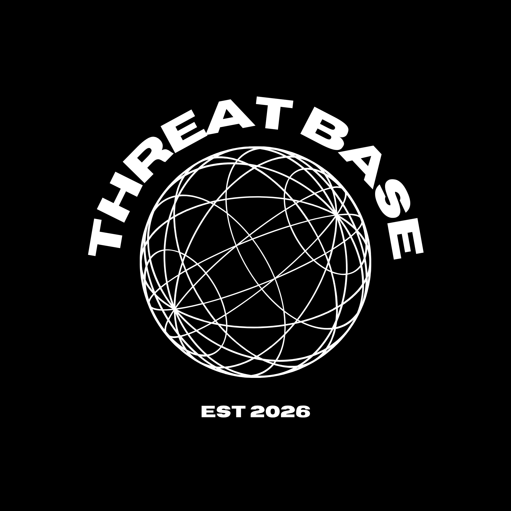

  
  
  <h1>Threatbase (v3)</h1>
  
  

    
    
    
    
  

  
  <h3>A fully-automated, enterprise-grade Threat Intelligence Aggregator & Dashboard.</h3>
  
<em>Powered by curiosity and driven by community OSINT</em>

 

Threatbase is a high-performance threat intelligence ecosystem. It consists of two major components:
1. **The Backend Intelligence Engine**: Automatically collects, deduplicates, and curates malicious Indicators of Compromise (IOCs) from industry-leading open-source feeds.
2. **The Threat Dashboard**: A breathtaking, ultra-premium SaaS frontend built in React that allows defenders to view analytics, search indicators, and manually report live threats.

 

  <h2>❤️ Our Mission</h2>
  

    <em>Built with love ❤️ to secure cyber life.</em>  
    Threatbase is dedicated to empowering defenders worldwide by democratizing access to high-quality threat intelligence.  
    Our mission is to make the digital world a safer place, one indicator at a time.
  

 

---

## 📡 Upstream Intelligence Sources

Threatbase curates and deduplicates data from the following authoritative threat intelligence providers:

| Provider | Focus Area | Aggregated IOC Types |
| :--- | :--- | :--- |
| **Abuse.ch (FeodoTracker / URLhaus / MalwareBazaar)** | Botnets, C2s, Malware Delivery | IPs, Domains, URLs, Hashes |
| **Spamhaus (DROP / EDROP)** | Spam, Hijacked Networks | IPs, CIDRs |
| **FireHOL** | Botnets, Cybercrime Networks | IPs |
| **DShield (SANS ISC)** | Port Scanners, Bruteforcers | IPs |
| **PhishTank / OpenPhish** | Phishing Campaigns | Domains, URLs |
| **Emerging Threats / CINS Army** | Compromised Hosts | IPs |
| **Hagezi** | DNS Blocklists (Malware/Ads) | Domains |
| **Blocklist.de / GreenSnow** | SSH/FTP Bruteforcers | IPs |

*See our [Acknowledgements](https://threatbase.qzz.io/thanks) page in the app for a full list.*

---

## 📄 Using the Threat Feeds directly

All IOC files are committed directly to this repository and are served continuously via GitHub Raw.

### 🌐 Network Blocklists (IPs & CIDRs)
Use these lists directly in firewall and Edge routing tables.
- **[IPv4 Blocklist](https://raw.githubusercontent.com/kalidada18/threatbase/main/ioc/malicious_ips.txt)** (`malicious_ips.txt`)
- **[IPv6 Blocklist](https://raw.githubusercontent.com/kalidada18/threatbase/main/ioc/malicious_ipv6.txt)** (`malicious_ipv6.txt`)
- **[CIDR Blocklist](https://raw.githubusercontent.com/kalidada18/threatbase/main/ioc/malicious_cidrs.txt)** (`malicious_cidrs.txt`)

### 🕸️ DNS & Web Blocklists (Domains & URLs)
Use these lists for DNS sinkholing (Pi-Hole, AdGuard) and web proxy blocking.
- **[Domain Blocklist](https://raw.githubusercontent.com/kalidada18/threatbase/main/ioc/malicious_domains.txt)** (`malicious_domains.txt`)
- **[URL Blocklist](https://raw.githubusercontent.com/kalidada18/threatbase/main/ioc/malicious_urls.txt)** (`malicious_urls.txt`)

### 💀 File Hashes (SHA-256)
Over 1,000,000+ malware samples for Endpoint Detection & Response (EDR) ingestion.
- **[Malware Hashes](https://raw.githubusercontent.com/kalidada18/threatbase/main/ioc/malicious_hashes.txt)** (`malicious_hashes.txt`)

---

## 🗄️ Historical Archives

A zip archive of the complete feed is published daily to the **[Releases](https://github.com/kalidada18/threatbase/releases)** page. These historical snapshots are ideal for retrospective SIEM hunting and academic research.

---

  ⚖️ <a href="LICENSE">MIT License</a> &nbsp;·&nbsp; upstream feed data subject to each provider's ToS.

