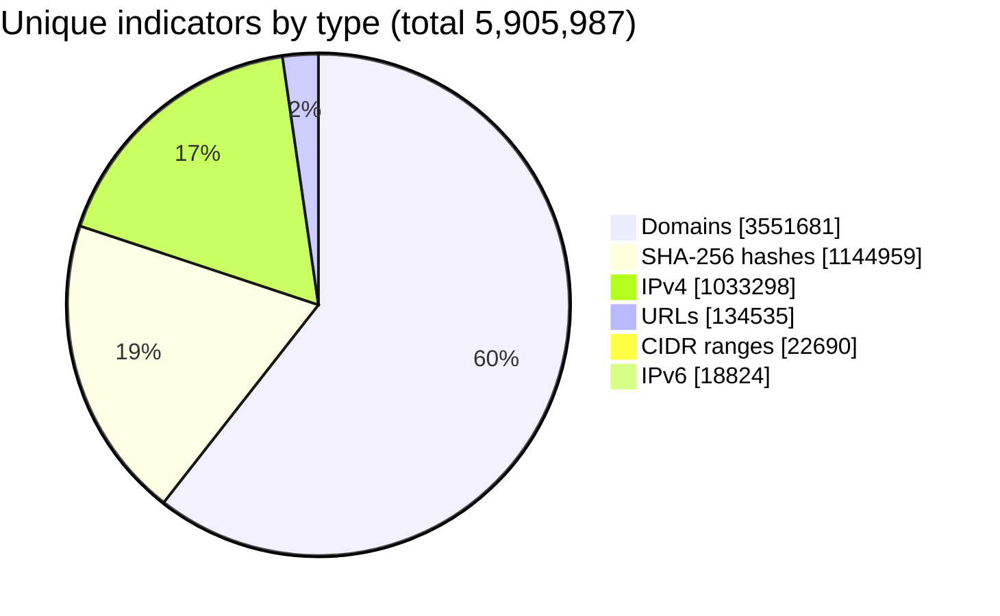
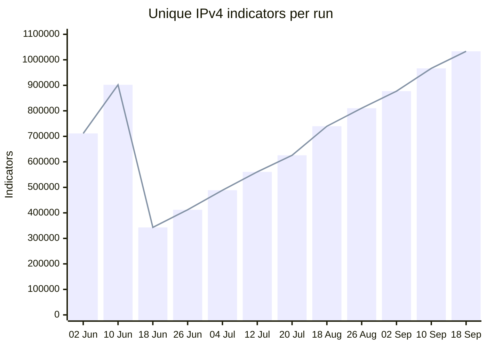
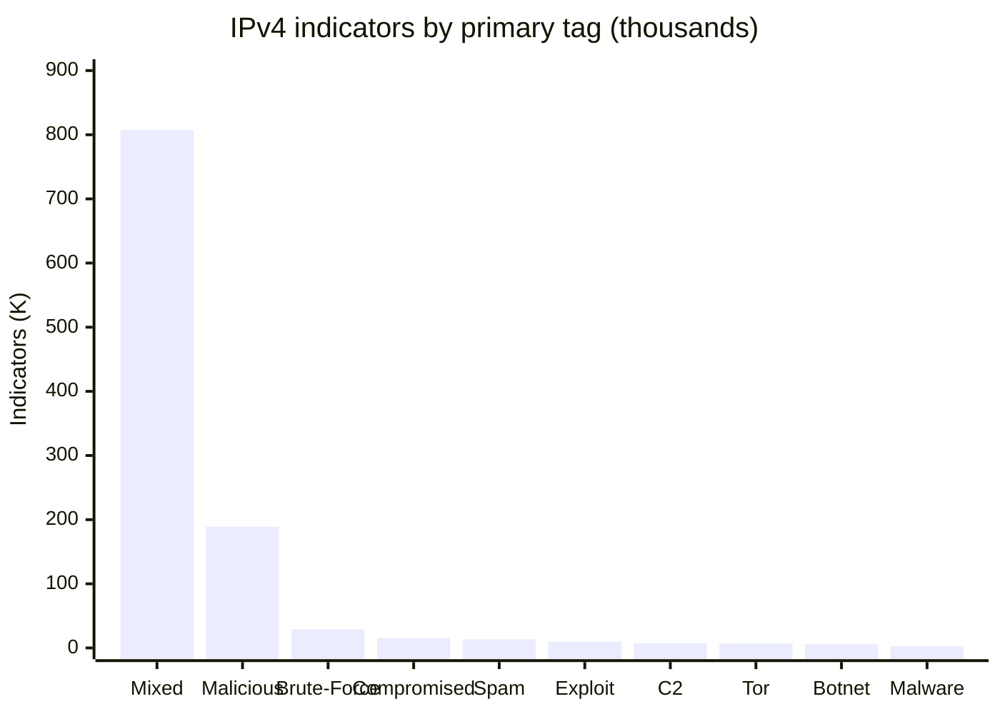
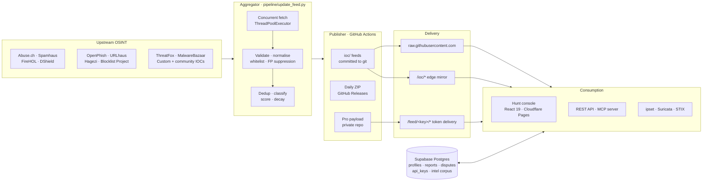
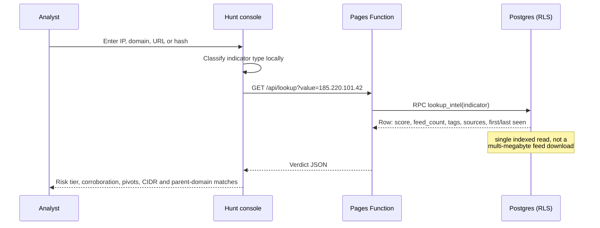
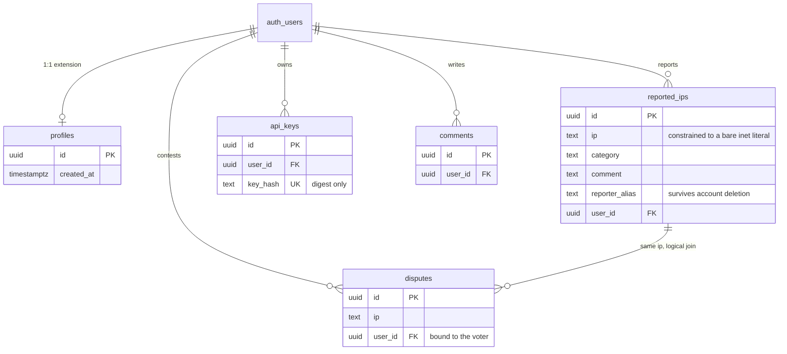

<div align="center">
  <br/>
  

  <h1>Threatbase</h1>

  <p>
    <strong>Enterprise-grade threat intelligence, built entirely on open sources.</strong><br/>
    Aggregated · Deduplicated · Classified · Delivered at zero cost.
  </p>

  <p>
    
    
    
    
    
  </p>

  <p>
    
    
    
    
    
  </p>

  <p>
    <a href="https://threatbase.qzz.io"><b>Hunt an IOC</b></a>
    &nbsp;·&nbsp;
    <a href="https://threatbase.qzz.io/threatfeed"><b>Threat feed</b></a>
    &nbsp;·&nbsp;
    <a href="https://threatbase.qzz.io/api"><b>API docs</b></a>
    &nbsp;·&nbsp;
    <a href="#using-the-feeds"><b>Raw feeds</b></a>
    &nbsp;·&nbsp;
    <a href="#quick-start"><b>Run it locally</b></a>
    &nbsp;·&nbsp;
    <a href="#threatbase-pro"><b>Pro</b></a>
    &nbsp;·&nbsp;
    <a href="https://github.com/kalidada18/threatbase/releases"><b>Archives</b></a>
  </p>

  <br/>

  <em>Threatbase aggregates, deduplicates and distributes open-source threat intelligence at
  scale, so defenders everywhere can block what attackers already know.</em>
</div>

---

**Contents**

| | |
|:--|:--|
| [What is Threatbase?](#what-is-threatbase) | [Threatbase Pro](#threatbase-pro) |
| [Coverage dashboard](#coverage-dashboard) | [Web console](#web-console) |
| [Architecture](#architecture) | [Security posture](#security-posture) |
| [Repository structure](#repository-structure) | [Quick start](#quick-start) |
| [Data model](#data-model) | [Running the pipeline](#running-the-pipeline) |
| [Using the feeds](#using-the-feeds) | [CI and operations](#ci-and-operations) |
| [API reference](#api-reference) | [Historical archives](#historical-archives) |
| [MCP server](#mcp-server) | [Upstream sources](#upstream-sources) |
| [Deploy-ready formats](#deploy-ready-formats) | [Contributing](#contributing) |
| [STIX 2.1 and TAXII](#stix-21-and-taxii) | [Licence and attribution](#licence-and-attribution) |

---

## What is Threatbase?

Threatbase is a **fully automated threat-intelligence pipeline and delivery platform**. It pulls
from dozens of authoritative OSINT feeds, validates and de-duplicates every indicator, classifies
it by threat behaviour, and publishes the result as ready-to-use blocklists, a JSON API, an MCP
server for AI agents, and a browser-based hunt console.

Nothing about the free tier requires an account, a token, or an upstream licence negotiation: the
feeds are plain text on a CDN, the code is MIT, and the whole system runs on infrastructure that
costs nothing to operate.

| | |
|:--|:--|
| **Corpus** | 5,905,987 unique indicators across 6 types, latest run 54 sources |
| **Delivery** | Raw blocklists · edge mirror · REST API · MCP · STIX 2.1 (Pro) · firewall-native shapes (Pro) |
| **Quality** | Per-indicator corroboration count, behaviour tags, first/last-seen, 90-day confidence decay |
| **Console** | IOC hunt, bulk and CSV hunt, RDAP whois, geo, community reports, disputes, leaderboard |
| **Stack** | Python 3.11 · GitHub Actions · React 19 · Cloudflare Pages Functions · Supabase Postgres |

> **Live numbers in this file are a snapshot** of
> [`ioc/data/stats.json`](ioc/data/stats.json) taken on `2026-09-18T10:19Z`.
> Every figure below is reproducible from that file — read it at runtime instead of
> trusting a README.

---

## Coverage dashboard

### Unique indicators by type


```mermaid
pie showData
    title Unique indicators by type (total 5,905,987)
    "Domains" : 3551681
    "SHA-256 hashes" : 1144959
    "IPv4" : 1033298
    "URLs" : 134535
    "CIDR ranges" : 22690
    "IPv6" : 18824
```

### IPv4 corpus, last 90 days

Sampled from the daily series in [`ioc/data/history.json`](ioc/data/history.json)
(89 recorded runs, 2 June to 18 September). Every point is published unedited — including the
June step-down.


```mermaid
xychart-beta
    title "Unique IPv4 indicators per run"
    x-axis ["02 Jun", "10 Jun", "18 Jun", "26 Jun", "04 Jul", "12 Jul", "20 Jul", "18 Aug", "26 Aug", "02 Sep", "10 Sep", "18 Sep"]
    y-axis "Indicators" 0 --> 1100000
    bar [711428, 901974, 343023, 412197, 488780, 560653, 625800, 739620, 810353, 877168, 966503, 1033298]
    line [711428, 901974, 343023, 412197, 488780, 560653, 625800, 739620, 810353, 877168, 966503, 1033298]
```

### Classification of the IPv4 feed

Behaviour tags are assigned per indicator, not per upstream feed, so one IP can carry several.
The category totals therefore exceed the IPv4 total.


```mermaid
xychart-beta
    title "IPv4 indicators by primary tag (thousands)"
    x-axis ["Mixed", "Malicious", "Brute-Force", "Compromised", "Spam", "Exploit", "C2", "Tor", "Botnet", "Malware"]
    y-axis "Indicators (K)" 0 --> 900
    bar [807.7, 189.1, 29.4, 15.6, 13.5, 10.0, 7.6, 6.8, 6.4, 2.7]
```

### Indicator types

| Type | Volume | Format | Primary use case |
|:--|--:|:--|:--|
| **IPv4** | 1,033,298 | CSV with score, tags and source trail | Firewall blocklists, SIEM correlation |
| **Domains** | 3,551,681 | One per line, with first-seen | DNS sinkholing, Pi-hole, AdGuard, EDL |
| **SHA-256 hashes** | 1,144,959 | One per line, with first-seen | EDR ingestion, malware triage |
| **URLs** | 134,535 | Full URL per line | Proxy / NGFW blocking |
| **CIDR ranges** | 22,690 | CIDR notation | BGP null-routing, edge filtering |
| **IPv6** | 18,824 | One per line | Next-gen network blocking |

### Freshness and confidence decay

The aggregator does not treat a two-year-old sighting as equivalent to yesterday's.

| Model parameter | Value | Effect |
|:--|:--|:--|
| Half-life | 90 days | Corroboration weight halves every 90 days without a fresh sighting |
| Stale threshold | 365 days | Indicators unseen for a year drop out of the published feed |
| Average freshness | 9.6 days | Mean age of the current corpus |
| Stale indicators published | 0 | The decay filter is applied before write |

Source-level telemetry lives in
[`ioc/data/feed_health.json`](ioc/data/feed_health.json), which records `last_data`,
`last_new_count` and `consecutive_empty` for every upstream. A source that goes quiet is
visible as a number instead of silently shrinking the corpus: in the current snapshot 17 of
the 42 tracked IP sources show `consecutive_empty = 57`, i.e. they have contributed no *new*
indicators in 57 consecutive runs, while `active_feeds = 54` counts sources that returned
usable data in the last run.

---

## Architecture


```mermaid
flowchart LR
    subgraph SRC["Upstream OSINT"]
        A1["Abuse.ch · Spamhaus<br/>FireHOL · DShield"]
        A2["OpenPhish · URLhaus<br/>Hagezi · Blocklist Project"]
        A3["ThreatFox · MalwareBazaar<br/>Custom + community IOCs"]
    end

    subgraph AGG["Aggregator · pipeline/update_feed.py"]
        B1["Concurrent fetch<br/>ThreadPoolExecutor"]
        B2["Validate · normalise<br/>whitelist · FP suppression"]
        B3["Dedup · classify<br/>score · decay"]
        B1 --> B2 --> B3
    end

    subgraph PUB["Publisher · GitHub Actions"]
        C1["ioc/ feeds<br/>committed to git"]
        C2["Daily ZIP<br/>GitHub Releases"]
        C3["Pro payload<br/>private repo"]
    end

    subgraph EDGE["Delivery"]
        D1["raw.githubusercontent.com"]
        D2["/ioc/* edge mirror"]
        D3["/feed/&lt;key&gt;/* token delivery"]
    end

    subgraph APP["Consumption"]
        E1["Hunt console<br/>React 19 · Cloudflare Pages"]
        E2["REST API · MCP server"]
        E3["ipset · Suricata · STIX"]
    end

    SRC --> AGG
    AGG --> PUB
    C1 --> D1
    C1 --> D2
    C3 --> D3
    D1 --> APP
    D2 --> APP
    D3 --> APP
    DB[("Supabase Postgres<br/>profiles · reports · disputes<br/>api_keys · intel corpus")] <--> APP
```

| Layer | Stack | Responsibility |
|:--|:--|:--|
| **Intelligence engine** | Python 3.11 · `requests` · `ThreadPoolExecutor` | Concurrent ingestion, validation, de-duplication, classification, scoring |
| **Automation** | GitHub Actions | `update-feed.yml` publishes feeds and archives; `import-ip-intel.yml` loads the bulk corpus. Both are `workflow_dispatch` only — no cron |
| **Web console** | React 19 · Vite · Tailwind · Framer Motion · Cloudflare Pages | IOC hunt, verdict cards, bulk/CSV hunt, RDAP whois, geo, community reports |
| **API & community** | Cloudflare Pages Functions · Supabase · KV rate limiting | Scan and report endpoints, MCP server, Pro feed delivery, Turnstile-gated auth |
| **Delivery** | GitHub Raw · `/ioc/*` edge mirror | Zero-infrastructure blocklist serving; `https://threatbase.qzz.io/ioc/…` mirrors every public file with CDN caching |
| **Archives** | GitHub Releases | Daily ZIP snapshot plus unsplit domain and hash feeds on the rolling `latest` tag |
| **Large-feed mirrors** | Git chunks · release assets | Domain and hash feeds exceed GitHub's file limit, so they ship as ~35–44 MiB sorted chunks under `ioc/domain/` and `ioc/hash/` |

### Anatomy of a verdict lookup


```mermaid
sequenceDiagram
    participant U as Analyst
    participant C as Hunt console
    participant F as Pages Function
    participant P as Postgres (RLS)

    U->>C: Enter IP, domain, URL or hash
    C->>C: Classify indicator type locally
    C->>F: GET /api/lookup?value=185.220.101.42
    F->>P: RPC lookup_intel(indicator)
    P-->>F: Row: score, feed_count, tags, sources, first/last seen
    Note over P: single indexed read, not a<br/>multi-megabyte feed download
    F-->>C: Verdict JSON
    C-->>U: Risk tier, corroboration, pivots, CIDR and parent-domain matches
```

### Repository structure

```text
threatbase/
├── pipeline/           Feed engine (run from repo root)
│   ├── update_feed.py         54 sources, dedup, classify, publish
│   ├── import_ip_intel.py     Bulk-load feeds into the Postgres corpus
│   ├── sync_community_reports.py
│   ├── whitelist.txt          Never-publish ranges (research, RFC-reserved)
│   ├── custom_iocs.txt        Threatbase-owned indicators
│   └── test_*.py              pytest suites for the above
├── ioc/                Generated public feeds, organised by type
│   ├── ip/             IPv4, IPv6, CIDR, categories/, top_ips.json
│   ├── domain/         Domain feed chunks
│   ├── hash/           Hash feed chunks
│   ├── url/            URL feed
│   ├── misp/           MISP free-text exports (IP · domain · URL · hash)
│   └── data/           stats · manifest · history · geo · feed_health · community
├── src/                Web console
│   ├── components/     Pages, blocks/, layout/, ui/, motion/
│   ├── lib/            Validation, verdict logic, rate gates, helpers
│   └── *.ts(x)         App shell, router, auth context, scanner
├── functions/          Cloudflare Pages Functions (the API)
│   ├── api/            lookup · scan · report · rdap · geo · community · MCP admin
│   ├── ioc/            Same-origin edge mirror of every public feed
│   ├── feed/           Token-authenticated Pro delivery
│   └── mcp/            Model Context Protocol server
├── db/                 Supabase SQL: schema, RLS, RPCs (applied by hand, see db/README.md)
├── public/             Static assets, _redirects, _headers, robots, sitemap
├── .github/            ci.yml · update-feed.yml · import-ip-intel.yml · pinned action
└── SECURITY.md         Vulnerability disclosure policy and safe harbour
```

Generated but intentionally **not** committed: `ioc/ip/categories/`, `ioc/firewall/` and
`ioc/stix/`. They are listed in `.gitignore` and pushed by the workflow to a private
repository, because a public copy would make the `/feed/<key>/` paywall unenforceable.

---

## Data model

Postgres on Supabase. Every table below is protected by row-level security; the bulk intel
corpus has RLS enabled with **no policies**, so only the `service_role` key can read it and all
public access goes through the `lookup_intel` RPC.


```mermaid
erDiagram
    auth_users ||--o| profiles : "1:1 extension"
    auth_users ||--o{ reported_ips : "reports"
    auth_users ||--o{ disputes : "contests"
    auth_users ||--o{ api_keys : "owns"
    auth_users ||--o{ comments : "writes"
    reported_ips ||--o{ disputes : "same ip, logical join"

    profiles {
        uuid id PK
        timestamptz created_at
    }
    reported_ips {
        uuid id PK
        text ip "constrained to a bare inet literal"
        text category
        text comment
        text reporter_alias "survives account deletion"
        uuid user_id FK
    }
    disputes {
        uuid id PK
        text ip
        uuid user_id FK "bound to the voter"
    }
    api_keys {
        uuid id PK
        uuid user_id FK
        text key_hash UK "digest only"
    }
    comments {
        uuid id PK
        uuid user_id FK
    }
```

Notes that matter when you change this schema:

- `api_keys.key_hash` stores a digest only. A leaked table cannot be replayed against the API.
- `disputes.user_id` is `NOT NULL DEFAULT auth.uid()`, so a dispute is bound to an account and
  unique per `(ip, user)` — one vote each.
- `reported_ips.reporter_alias` survives account deletion so the leaderboard and feeds keep
  attributing historical reports.
- Three bulk tables (`ip_intel`, `indicator_intel`, `hash_intel`) hold the normalised corpus and
  power single-row verdict reads; `lookup_intel` is the only read path into them.
- `db/*.sql` files are hand-maintained and idempotent. Apply order and the two files that need
  edits on a fresh database are documented in [`db/README.md`](db/README.md).

---

## Quick Start

### Prerequisites

| Tool | Version | Needed for |
|:--|:--|:--|
| Node.js | 20+ | Console, Functions, build |
| npm | 10+ | Package management |
| Python | 3.11 | Pipeline and its tests |
| Wrangler | installed as a dev dependency | Local Functions runtime and deploys |
| Git | 2+ | Feeds are committed to the repo |

### Console and API

```bash
git clone https://github.com/kalidada18/threatbase.git
cd threatbase
npm install

cp .env.example .env        # Turnstile site key; Supabase falls back to hosted values
npm run dev                 # Vite dev server on http://localhost:9999
```

`npm run dev` serves the console only. Pages Functions (`/api/*`, `/ioc/*`, `/feed/*`, `/mcp`)
require the Wrangler runtime:

```bash
npm run build && npm run preview          # build + wrangler pages dev on http://localhost:8788
```

Local Functions read secrets from `.dev.vars` and bindings from `wrangler.jsonc`
(KV namespace `IOC_CACHE`, `nodejs_compat`). Deploy-time commands need `npx wrangler login`
once. Turnstile's secret half is set as a Pages secret, never in `.env`:

```bash
npx wrangler pages secret put TURNSTILE_SECRET
```

### Quality gates

```bash
npm run typecheck    # tsc --noEmit
npm run lint         # eslint .
npm test             # vitest run (unit + logic suites in src/ and functions/)
npm run build        # production bundle into dist/
```

### Deploy

```bash
npm run deploy       # vite build && wrangler pages deploy dist --project-name threatbase
```

The site is served from Cloudflare Pages with the SPA rewrite `/* → /index.html 200` and a
locked-down response-header policy defined in [`public/_headers`](public/_headers).

---

## Running the pipeline

The aggregator is a single Python script that reads its feed registry from source and writes the
`ioc/` tree. Run it from the **repository root**, not from `pipeline/`.

```bash
python -m venv .venv && source .venv/bin/activate   # Windows: .venv\Scripts\activate
pip install -r pipeline/requirements.txt

python pipeline/update_feed.py                      # fetch, dedup, classify, publish locally
```

Key inputs and switches:

| Path / variable | Role |
|:--|:--|
| `pipeline/update_feed.py` → `FEEDS`, `DOMAIN_FEEDS`, `HASH_FEEDS`, `URL_FEEDS`, `THREATFOX_FEEDS` | The upstream registry: 54 sources in total. Add one here and a matching entry in `FEED_CATEGORIES` |
| `ABUSEIPDB_API_KEY` | Optional. When set, AbuseIPDB's reputation blacklist is appended as a 55th source |
| `pipeline/whitelist.txt` | Ranges that must never be published (reserved, research, known-good infrastructure) |
| `pipeline/custom_iocs.txt` | Threatbase-owned indicators, injected with the `custom` tag |
| `PRO_ENABLED` | When set, also writes `ioc/ip/categories/`, `ioc/firewall/`, `ioc/stix/` and `manifest-pro.json` |
| `SUPABASE_URL` + `SUPABASE_SERVICE_KEY` | Required by `sync_community_reports.py` and `import_ip_intel.py` only |

Transient upstream failures are retried three times with linear backoff (`MAX_RETRIES`,
`RETRY_BACKOFF`), because dropping a single fetch silently removes live indicators from the run.

Pipeline regression suites:

```bash
pip install pytest
pytest pipeline/test_import_ip_intel.py pipeline/test_dispute_poisoning.py
```

`test_dispute_poisoning.py` is the guard for the community-abuse path: it proves a reported
indicator cannot be suppressed by mass-disputing it from other accounts.

---

## Using the Feeds

Every public feed is committed to this repository and served over **GitHub Raw** — drop the URL
straight into your tooling. No auth, no per-request rate limit, no licence negotiation.

`https://threatbase.qzz.io/ioc/…` is a same-origin, edge-cached mirror of every public file,
which suits tooling that blocks or throttles `raw.githubusercontent.com`.

> Feeds live in type folders — `ioc/ip/`, `ioc/domain/`, `ioc/hash/`, `ioc/url/`, `ioc/data/`.
> The old flat `ioc/<file>` raw URLs are retired; release-asset download URLs are unchanged.
> Per-category and firewall-format feeds are [Pro](#threatbase-pro) and are not in this repo.
> Everything else stays free and MIT — each section notes the one-liner that reproduces the
> Pro shape off the full feed.

### Network blocklists

```text
https://raw.githubusercontent.com/kalidada18/threatbase/main/ioc/ip/threatbase-ip.txt
https://raw.githubusercontent.com/kalidada18/threatbase/main/ioc/ip/threatbase-ipv6.txt
https://raw.githubusercontent.com/kalidada18/threatbase/main/ioc/ip/threatbase-cidr.txt
```

| Feed | File | Format |
|:--|:--|:--|
| IPv4 blocklist | `threatbase-ip.txt` | `IP,FeedCount,RiskScore,Tags,FirstSeen,LastSeen,Sources` |
| IPv6 blocklist | `threatbase-ipv6.txt` | One IPv6 address per line |
| CIDR blocklist | `threatbase-cidr.txt` | CIDR notation |

The IPv4 header columns are the whole product: `FeedCount` is how many **independent** upstreams
saw the address, `Tags` carries the behaviour classification, and `Sources` names them.

### DNS and web blocklists

Compatible with Pi-hole, AdGuard Home, Squid and Palo Alto EDL.

```text
https://github.com/kalidada18/threatbase/releases/download/latest/threatbase-domain.txt
https://raw.githubusercontent.com/kalidada18/threatbase/main/ioc/url/threatbase-url.txt
```

| Feed | File | Format |
|:--|:--|:--|
| Domain blocklist | `threatbase-domain.txt` | One domain per line, with first-seen |
| URL blocklist | `threatbase-url.txt` | Full URL per line |

### Malware file hashes

```text
https://github.com/kalidada18/threatbase/releases/download/latest/threatbase-hash.txt
```

| Feed | File | Format |
|:--|:--|:--|
| Malware hash DB | `threatbase-hash.txt` | SHA-256 per line, with first-seen |

### Chunked mirrors of the large feeds

The domain and hash feeds exceed GitHub's single-file limit, so the repository also carries them
split into git-committed chunks under [`ioc/domain/`](ioc/domain/) and
[`ioc/hash/`](ioc/hash/). Release assets stay the recommended download for humans; the chunks are
for tooling that prefers plain `raw.githubusercontent.com` pulls.

```text
https://raw.githubusercontent.com/kalidada18/threatbase/main/ioc/domain/threatbase-domain-01.txt
https://raw.githubusercontent.com/kalidada18/threatbase/main/ioc/domain/threatbase-domain-02.txt
https://raw.githubusercontent.com/kalidada18/threatbase/main/ioc/domain/threatbase-domain-03.txt
https://raw.githubusercontent.com/kalidada18/threatbase/main/ioc/hash/threatbase-hash-01.txt
https://raw.githubusercontent.com/kalidada18/threatbase/main/ioc/hash/threatbase-hash-02.txt
```

<details>
<summary><strong>Chunk rules</strong></summary>

<br/>

- Chunks **partition the sorted feed**: each covers a contiguous key range and is individually
  sorted, so concatenating them in numeric order reproduces the unsplit file byte for byte.
- The chunk **count is never fixed** — it grows with the feed (3 for domains and 2 for hashes
  today). Read the authoritative layout from
  [`ioc/data/manifest.json`](ioc/data/manifest.json) or the `chunks` / `chunk_files` keys of
  [`ioc/data/stats.json`](ioc/data/stats.json) instead of hardcoding a number.
- Because ranges are contiguous, a lookup tool can binary-search one chunk directly, or skip all
  downloads when a query falls between two chunks' ranges. That is exactly how the hunt console
  works: it fetches only the single chunk that can contain the query.

</details>

### MISP free-text exports

Paste straight into a MISP attribute import — one indicator per line, no CSV.

```text
https://raw.githubusercontent.com/kalidada18/threatbase/main/ioc/misp/threatbase-ip.txt
https://raw.githubusercontent.com/kalidada18/threatbase/main/ioc/misp/threatbase-domain.txt
https://raw.githubusercontent.com/kalidada18/threatbase/main/ioc/misp/threatbase-url.txt
https://raw.githubusercontent.com/kalidada18/threatbase/main/ioc/misp/threatbase-hash.txt
```

### Machine-readable metadata

| File | Contents |
|:--|:--|
| [`ioc/data/stats.json`](ioc/data/stats.json) | Totals per type, category counts, Pro format counts, chunk layout, decay config, `last_updated` |
| [`ioc/data/manifest.json`](ioc/data/manifest.json) | SHA-256 and byte/line count for every public feed |
| [`ioc/data/history.json`](ioc/data/history.json) | Daily series behind the charts in this README |
| [`ioc/data/feed_health.json`](ioc/data/feed_health.json) | Per-source freshness and consecutive-empty-run counter |
| [`ioc/data/geo.json`](ioc/data/geo.json) | Country distribution of the IPv4 corpus |
| [`ioc/data/community_reports.json`](ioc/data/community_reports.json) | Community-submitted indicators folded into the feed |

Verify a download against the manifest:

```bash
curl -s https://raw.githubusercontent.com/kalidada18/threatbase/main/ioc/data/manifest.json \
  | jq -r '.checksums["ip/threatbase-ipv6.txt"]'
sha256sum threatbase-ipv6.txt
```

---

## API Reference

Base URL: `https://threatbase.qzz.io/api/v1`
Interactive docs and copy-paste examples: **[threatbase.qzz.io/api](https://threatbase.qzz.io/api)**

All `/api/v1` endpoints require an API key on the `x-api-key` header. Mint keys (maximum three
per account) on your [Profile](https://threatbase.qzz.io/profile) page; minting requires a
second-factor-verified session.

| Limit | Value |
|:--|:--|
| Requests per key per day | 1,000, charged per indicator on batch calls |
| Indicators per batch request | 100 |
| Indicator length | 255 characters |
| Failed-auth attempts per IP per day | 100 |
| Batch size limit is enforced before any DB work | Yes — invalid keys are rate-limited first |

| Method | Endpoint | Purpose |
|:--|:--|:--|
| `GET` | `/api/v1/scan?ip=<indicator>` | Single-indicator verdict |
| `POST` | `/api/v1/scan` | Batch verdicts, up to 100 typed indicators |
| `POST` | `/api/v1/report` | Submit an indicator with category and evidence |

### Single scan

```bash
curl -H "x-api-key: $TB_KEY" \
  "https://threatbase.qzz.io/api/v1/scan?ip=185.220.101.42"
```

```json
{
  "success": true,
  "data": {
    "type": "ipv4",
    "ip": "185.220.101.42",
    "isMalicious": true,
    "riskScore": "High",
    "feedCount": 6,
    "isDisputed": false,
    "disputeCount": 0,
    "tags": ["Tor", "Exploit"],
    "sources": ["dan_tor", "blocklist_de"],
    "matchedCidr": "185.220.101.0/24",
    "relatedMatch": null
  }
}
```

`riskScore` is a tier derived from the decayed corroboration score: `High` at 90 and above,
`Medium` at 60 and above, otherwise `Low`. `matchedCidr` reports the widest public artefact that
covers the address, and `relatedMatch` the pivot that produced the hit — a domain query can
resolve to the parent-domain or CIDR record that is actually listed.

### Batch scan

```bash
curl -X POST -H "x-api-key: $TB_KEY" -H "Content-Type: application/json" \
  -d '{"indicators":[{"type":"ipv4","value":"1.2.3.4"},{"type":"domain","value":"evil.example"}]}' \
  "https://threatbase.qzz.io/api/v1/scan"
```

Accepted `type` values: `ipv4`, `ipv6`, `domain`, `url`, `md5`, `sha1`, `sha256`.

Structural problems (malformed JSON, empty or oversized array) return `400`. Per-indicator
validation failures come back as `status: "error"` entries inside `results`, so callers always
receive one result per submitted indicator:

```json
{
  "results": [
    { "type": "ipv4", "value": "1.2.3.4", "malicious": true, "status": "malicious", "feedCount": 3, "riskScore": "High", "tags": ["C2"], "sources": ["feodo_tracker"] },
    { "type": "domain", "value": "not a domain", "malicious": false, "status": "error", "error": "Invalid domain" }
  ],
  "total": 2
}
```

### Reporting

```bash
curl -X POST -H "x-api-key: $TB_KEY" -H "Content-Type: application/json" \
  -d '{"ip":"203.0.113.7","category":"Brute-Force","comment":"14 successful SSH auths in 10 minutes to three hosts."}' \
  "https://threatbase.qzz.io/api/v1/report"
```

`ip`, `category` and `comment` are all required; `comment` is capped at 1,000 characters.
Duplicate reports from the same account return `409`. Reports are written through a definer RPC
with the service key held server-side, validated as a public IPv4 or IPv6 address, and are
ingested by the next pipeline run.

### Errors

| Status | Meaning |
|:--|:--|
| `400` | Malformed body, missing field, oversized or invalid indicator |
| `401` | Missing or unknown `x-api-key` |
| `409` | This account already reported the indicator |
| `429` | Daily key quota exhausted, or too many failed authentication attempts |
| `503` | Reporting temporarily unavailable (service key not configured) |

CORS is enabled for browser callers with `Content-Type` and `x-api-key` allowed headers, and
`OPTIONS` preflight is answered before any authentication work.

---

## MCP Server

Point agent tooling at **`https://threatbase.qzz.io/mcp`** (Streamable HTTP transport). No key,
same fair-use posture as the public console.

| Tool | Returns |
|:--|:--|
| `scan_ioc` | Verdict for a single indicator |
| `batch_scan` | Verdicts for up to 100 indicators in one call |
| `feed_stats` | Live coverage counts straight from `stats.json` |

```json
{
  "mcpServers": {
    "threatbase": { "type": "http", "url": "https://threatbase.qzz.io/mcp" }
  }
}
```

---

## Deploy-Ready Formats

> **Pro.** The pipeline publishes the IPv4 feed pre-shaped for firewalls, IPS and SIEMs, so
> nothing has to be parsed downstream. Served under your own token at
> `https://threatbase.qzz.io/feed/<your-key>/firewall/<file>`.

| File | Shape | For | Size |
|:--|:--|:--|--:|
| `ip-plain.txt` | One bare IP per line, all 1,033,298 | pf, OPNsense, UFW, nftables — anything without an entry cap | 12.4 MB |
| `ip-multisource.txt` | Bare IPs with **2+ independent sources** (298,200) | Conservative hard-block policy | 4.2 MB |
| `ip-top50k.txt` | The **50,000 best-corroborated** IPs, bare | PAN-OS EDL, FortiGate threat feed | ~0.7 MB |
| `ip.ipset` | `ipset restore` file, atomic swap reload (set: `threatbase`) | Linux netfilter | 26.4 MB |
| `ip-suricata.rules` | `drop` rules for IPs with **3+ sources** (104,909, sids 50000000+) | Suricata / Snort IPS | 9.4 MB |
| `ip.jsonl.gz` | NDJSON `{ip, feeds, score, tags[], sources[], first_seen, last_seen}` | Splunk HEC, Elastic `_bulk`, Wazuh | 4.7 MB |
| `manifest-pro.json` | SHA-256 of every Pro file | Proving a feed survived transit | ~4 KB |

> **Use `ip-top50k.txt` on appliances.** PAN-OS caps external dynamic lists at **50,000 IP
> entries across all EDLs** (150,000 only on the PA-5000/PA-7000 series) and FortiGate's
> threat-feed ceiling is per model (300,000 on a 6K, lower beneath it). Neither tells you it
> dropped the overflow — feed a 1M-entry list to a standard PA and it silently enforces roughly
> 5 % of it. `ip-top50k.txt` is that corpus ranked by how many independent feeds corroborated
> each address, truncated to fit, so what you keep is what was worth keeping.

### Per-category, same six shapes

The [category split](#category-split-ip-feeds) is also published pre-shaped, so "hard-block C2,
alert-only on Tor" is two files rather than a CSV filter you maintain:

```text
https://threatbase.qzz.io/feed/<your-key>/firewall/categories/c2/ip.ipset
https://threatbase.qzz.io/feed/<your-key>/firewall/categories/tor/ip-suricata.rules
https://threatbase.qzz.io/feed/<your-key>/firewall/categories/bruteforce/ip.jsonl.gz
```

The slug is any of `c2`, `botnet`, `bruteforce`, `tor`, `spam`, `exploit`, `malware`,
`malicious`, `compromised`, `scanner`, `mixed`. Two guarantees let you load several side by side:

- **The ipset name is `threatbase-<slug>`**, so sets never collide on restore and each gets its
  own `--match-set` rule.
- **SIDs are blocked per category** — `c2` from 51000000, `botnet` from 52000000, then 1M per
  category in the order listed, with the full feed owning 50000000+. Suricata silently keeps only
  the last rule for a duplicated SID, so shared ranges would cost coverage; these are stable and
  safe to write `suppress` and `threshold` rules against. Threatbase claims
  **50000000–77999999** in the self-organised registry at
  [sidallocation.org](https://sidallocation.org/), so nothing here collides with ET Open,
  ExtraHop, Positive Technologies, IPFire or abuse.ch rules loaded alongside it.

```bash
# Linux firewall — one match rule instead of a million. The -exist flag is required:
# the file loads into a staging set and swaps atomically, so re-running this keeps the
# iptables rule working and never matches traffic against a half-loaded set.
curl -sO https://threatbase.qzz.io/feed/$KEY/firewall/ip.ipset
sudo ipset -exist restore < ip.ipset
sudo iptables -I INPUT -m set --match-set threatbase src -j DROP

# Per-category policy: drop C2 outright, log Tor only.
curl -s https://threatbase.qzz.io/feed/$KEY/firewall/categories/c2/ip.ipset  | sudo ipset -exist restore
curl -s https://threatbase.qzz.io/feed/$KEY/firewall/categories/tor/ip.ipset | sudo ipset -exist restore
sudo iptables -I INPUT -m set --match-set threatbase-c2  src -j DROP
sudo iptables -I INPUT -m set --match-set threatbase-tor src -j LOG --log-prefix 'TOR '

# Suricata IPS — add to suricata.yaml:
#   default-rule-path: /etc/suricata/rules
#   rule-files: [threatbase-ip.rules]
# Alerts instead of drops for a category? sed 's/^drop /alert /' on the file.

# SIEM bulk ingest (Splunk HEC and Elastic _bulk both accept gzip):
curl -s https://threatbase.qzz.io/feed/$KEY/firewall/ip.jsonl.gz | gunzip
```

> Why gate on source count rather than risk score? About 99 % of the corpus is tier HIGH, so tier
> does not discriminate. Independent corroboration does.

### Category-Split IP Feeds

Per-category IPv4 blocklists, in the same
`IP,FeedCount,RiskScore,Tags,FirstSeen,LastSeen,Sources` format, are a
[**Pro**](https://threatbase.qzz.io/pricing) feed. Generate a key on your
[Profile](https://threatbase.qzz.io/profile) page and fetch it under your own token:

```text
https://threatbase.qzz.io/feed/<your-key>/ip/categories/threatbase-ip-c2.txt
https://threatbase.qzz.io/feed/<your-key>/ip/categories/threatbase-ip-botnet.txt
https://threatbase.qzz.io/feed/<your-key>/ip/categories/threatbase-ip-bruteforce.txt
```

One stable URL your firewall can poll unattended.

| Category | File | Current volume | Use case |
|:--|:--|--:|:--|
| C2 | `threatbase-ip-c2.txt` | 7,607 | Command and control — block aggressively |
| Botnet | `threatbase-ip-botnet.txt` | 6,373 | Known botnet members |
| Brute-Force | `threatbase-ip-bruteforce.txt` | 29,366 | SSH, FTP and RDP brute-forcers |
| Exploit | `threatbase-ip-exploit.txt` | 10,041 | Active exploitation attempts |
| Compromised | `threatbase-ip-compromised.txt` | 15,613 | Hosts turned against their owner |
| Tor | `threatbase-ip-tor.txt` | 6,752 | Exit nodes — frequently alert-only |
| Spam | `threatbase-ip-spam.txt` | 13,531 | Spam-source networks |
| Malware | `threatbase-ip-malware.txt` | 2,728 | Malware hosting and delivery |
| Malicious | `threatbase-ip-malicious.txt` | 189,131 | Reputation-flagged infrastructure |
| Mixed | `threatbase-ip-mixed.txt` | 807,731 | Multi-purpose blocklists |

Per-file counts are published free of charge in
[`stats.json`](ioc/data/stats.json) under `ip_category_files`, even though the files themselves
are Pro. The full IPv4 feed carries the same `Tags` column, so you can split it yourself.

### STIX 2.1 and TAXII

> **Pro.** Every indicator type is also emitted as STIX 2.1 `indicator` objects, one bundle per
> collection page, so a TAXII client can subscribe by page rather than downloading a corpus.

| Collection | Objects |
|:--|--:|
| `ip` | 1,033,298 |
| `ip-<category>` (10 collections) | per category, as above |
| `domains` | 3,551,681 |
| `hashes` | 1,144,959 |
| `urls` | 134,535 |
| `ipv6` / `cidrs` | 18,824 / 22,690 |

Bundles are paginated at 50,000 objects to stay under platform push limits — roughly 21 pages for
the full IPv4 collection. Indicator IDs are UUIDv5 derived from a fixed namespace
(`7b8f0f4e-3d2a-4a1b-8c6e-9f0d2a1b3c4d`), so the same IOC maps to the same STIX ID across runs:
a re-publish heals a subscriber's store instead of churning it. Patterns use the standard
observables (`ipv4-addr`, `domain-name`, `url`, `file:hashes`, `ipv6-addr`), which is what
Microsoft Sentinel, MISP and OpenCTI expect.

---

## Threatbase Pro

Everything in [Using the feeds](#using-the-feeds) stays **free and MIT, permanently**. Pro covers
what starts to matter once a feed is wired into production kit: freshness, per-category policy,
first-party collection, delivery shapes, and accuracy you can hard-block on without hand-checking
it first.

| | Free | Pro |
|:--|:--:|:--:|
| Blocklists for all six IOC types | yes | yes |
| Hunt console, verdict cards, community reports | yes | yes |
| MIT-licensed, no auth, no per-request rate limit | yes | yes |
| 15-minute refresh | — | yes |
| First-party sensor telemetry (Threatbase-run honeypots) | — | yes |
| Per-category IP lists (C2, botnet, brute-force, spam, Tor, …) | — | yes |
| [Deploy-ready shapes](#deploy-ready-formats) per category (ipset, Suricata, NDJSON, EDL) | — | yes |
| [STIX 2.1 / TAXII collections](#stix-21-and-taxii) | — | yes |
| Stable token URL your firewall polls unattended | — | yes |
| False-positive suppression guarantee | — | yes |
| Signed `manifest-pro.json` integrity file | — | yes |
| Email support | — | yes |

<div align="center"><strong>$25 / month</strong> at launch &nbsp;·&nbsp; <a href="https://threatbase.qzz.io/pricing">Pricing and waitlist</a></div>

### The accuracy claims, concretely

Accuracy assertions are cheap, so here is the mechanism behind each one.

- **Corroboration is exposed, never averaged away.** Every IP carries `FeedCount` — how many
  *independent* upstreams saw it. `ip-multisource.txt` (2+), `ip-suricata.rules` (3+) and
  `ip-top50k.txt` (ranked, then cut to the appliance limit) are pre-filtered on it, so aggression
  is tuned by evidence rather than by a tier that reads HIGH for ~99 % of the corpus.
- **Classification per indicator, not per feed.** Tags travel with the address and drive the
  category split, so differential policy is two files instead of a filter you maintain.
- **Own aggregation.** Correlation, de-duplication, scoring and classification run in-house
  against raw observations instead of inheriting each upstream's verdict, so one noisy source
  cannot lift an indicator's confidence on its own.
- **Own sensors.** Pro is backed by first-party collection — honeypots and telemetry Threatbase
  runs itself — on top of the upstream set. A hit our own sensor observed does not wait for a
  public list to catch up, which is where a purely republishing feed is always a step behind.
- **15-minute refresh.** Scanner and brute-force infrastructure rotates within hours; a daily list
  is stale for precisely the categories that move fastest.
- **False-positive suppression.** `pipeline/whitelist.txt` and community-reported FPs are applied
  before publish, and an indicator you get removed stops shipping in the next run.
- **Integrity you can verify.** `manifest-pro.json` carries a SHA-256 for every Pro file, so a
  feed truncated in transit fails loudly instead of quietly shrinking your blocklist.

> **Launching soon.** Email **threatbasepro@gmail.com** to join the waitlist; keys are issued from
> your [Profile](https://threatbase.qzz.io/profile) page once an account is flagged Pro.
> Onboarding is manual for now, so expect a reply rather than a checkout.

---

## Web Console

**[threatbase.qzz.io](https://threatbase.qzz.io)** — React 19 on Cloudflare Pages, with the
design system in [`tailwind.config.js`](tailwind.config.js) (Manrope and JetBrains Mono, a ruby
and platinum token ramp, glass surfaces).

| Route | Screen |
|:--|:--|
| `/` | IOC hunt: single-indicator verdict with corroboration, tags, pivots, RDAP and geo context, plus the bulk paste and CSV scanners |
| `/threatfeed` | Live coverage dashboard: totals, trend analytics, category mix, per-source feed health, MISP integration, live intel ticker |
| `/report` | Submit an indicator with category and evidence |
| `/contributors` | Community leaderboard with badges and contribution tiers |
| `/hall-of-shame` | Most-reported and most-corroborated infrastructure |
| `/api` | Interactive API documentation with worked examples |
| `/pricing` | Free versus Pro comparison and waitlist |
| `/profile` | Account, MFA enrolment, API keys, Pro status, deletion |
| `/about` `/faq` `/policy` `/terms` `/privacy` `/thanks` `/improvements` | Method, acceptable-use policy, legal, attribution, open improvement tracking |

Console capabilities worth knowing about: bulk paste and CSV hunt, RDAP-derived registration
context, CIDR and parent-domain pivoting, community dispute votes that flip a verdict to
`disputed` rather than deleting evidence, MFA-protected key minting, and a per-account activity
quota enforced in Postgres rather than in the client.

---

## Security Posture

| Control | Implementation |
|:--|:--|
| **Row-level security** | Every user-facing table is RLS-protected; the bulk intel corpus has RLS enabled with zero policies and is reachable only through definer RPCs |
| **Credential storage** | API keys are stored as SHA-256 digests; the plaintext is shown exactly once at mint time |
| **Step-up authentication** | `mint_api_key` and privileged writes require an `aal2` (MFA-verified) session |
| **Rate limiting** | Cloudflare KV buckets keyed per validated credential, charged per indicator, with a separate cap on failed auth attempts |
| **Human verification** | Cloudflare Turnstile on community write paths; the secret half lives in the Pages secret store, never in the bundle |
| **Injection and XSS** | Parameterised PostgREST access, `dompurify` on rendered user content, strict zod validation at every API boundary |
| **Abuse resistance** | Dispute-poisoning regression test proves a listed indicator cannot be suppressed by mass-voting from other accounts |
| **Browser hardening** | CSP with `object-src 'none'`, `base-uri 'self'`, `frame-ancestors 'none'`, HSTS preload, `nosniff`, COOP, locked-down `Permissions-Policy` |
| **Secrets hygiene** | Service-role key is server-only, read from Function `env`; `.env*` is gitignored apart from `.env.example` |
| **Supply chain** | The Supabase origin used by CI and the pipeline is pinned by a local [composite action](.github/actions/pin-supabase-origin/action.yml) |

Found a vulnerability? Report it privately through
[GitHub Security Advisories](https://github.com/kalidada18/threatbase/security/advisories/new).
Scope, response targets and safe-harbour terms are in
[SECURITY.md](SECURITY.md); a machine-readable policy is published at
[`/.well-known/security.txt`](https://threatbase.qzz.io/.well-known/security.txt).

> Feed contents are out of scope by design: an adversary's address appearing in a blocklist is
> the product working, not a defect.

---

## CI and Operations

[`ci.yml`](.github/workflows/ci.yml) runs on every push to `main` and on pull requests, with
concurrency cancellation so rapid pushes do not pile up redundant runs:

| Step | Gate |
|:--|:--|
| `npm ci` | Deterministic install |
| `npm run typecheck` | Informational for now — a pre-existing backlog is surfaced with `continue-on-error` |
| `npm run lint` | Blocking |
| `npm test` | Blocking (Vitest) |
| `npm run build` | Blocking (Vite production bundle) |

| Workflow | Trigger | What it does |
|:--|:--|:--|
| [`update-feed.yml`](.github/workflows/update-feed.yml) | `workflow_dispatch` | Runs the aggregator, commits the refreshed `ioc/` tree, publishes the daily ZIP and unsplit release assets, and pushes the Pro payload to the private repository when the token secret is configured |
| [`import-ip-intel.yml`](.github/workflows/import-ip-intel.yml) | `workflow_dispatch` | Loads a feed, CSV, hashfeed or key-value file into the Postgres corpus in batches; the service-role key never leaves the runner |
| [`ci.yml`](.github/workflows/ci.yml) | Push and pull request | Quality gates above |

Operational notes for anyone running this fork:

- `update-feed.yml` is **dispatch-driven, not scheduled** — publishing is an explicit act, so a
  broken upstream cannot push a degraded corpus unattended.
- The job carries a 30-minute timeout because the aggregator plus ~180 MB of release uploads
  exceeds the old budget; a cancelled mid-upload used to leave every
  `releases/download/latest/` URL serving the previous run.
- `concurrency: cancel-in-progress: false` on the feed job means a queued run waits rather than
  racing the active one on the same git push.
- Pro generation is gated on a secret: `PRO_ENABLED` is derived from the presence of the private
  repo token, so a fork without it produces a correct free-tier build.

---

## Historical Archives

A full ZIP of every feed is published to the **[Releases](https://github.com/kalidada18/threatbase/releases)**
page on each run, alongside the unsplit domain and hash feeds on the rolling
[`latest`](https://github.com/kalidada18/threatbase/releases/tag/latest) tag.

```text
threatbase-archive-YYYY.MM.DD.zip
├── threatbase-ip.txt
├── threatbase-ipv6.txt
├── threatbase-cidr.txt
├── threatbase-domain.txt
├── threatbase-url.txt
└── threatbase-hash.txt
```

Suited to retrospective SIEM hunting, academic research, and historical IOC enrichment.

---

## Upstream Sources

Threatbase curates and de-duplicates from authoritative providers including:

<details open>
<summary><strong>Source highlights</strong></summary>

<br/>

| Provider | Focus | Indicator types |
|:--|:--|:--|
| **Abuse.ch** — FeodoTracker, URLhaus, MalwareBazaar, ThreatFox, SSLblacklist | Botnets, C2, malware delivery | IP, domain, URL, hash |
| **Spamhaus** — DROP, EDROP, Dropv6 | Spam networks, hijacked ASNs | IP, CIDR, IPv6 |
| **FireHOL** — levels 1–3 | Cybercrime infrastructure | IP |
| **DShield / SANS ISC** | Port scanners, brute-forcers | IP, CIDR |
| **OpenPhish, Blocklist Project, StevenBlack** | Phishing and malicious domains | Domain, URL |
| **Emerging Threats, CINS Army, AlienVault** | Compromised hosts | IP |
| **Hagezi, Romain Marcoux** | DNS blocklists, outgoing reputation | Domain, IP |
| **Blocklist.de, GreenSnow, DataPlane, BinaryDefense** | SSH/FTP/mail abuse, service scanners | IP |
| **Tor Project, dan.me.uk** | Exit nodes | IP |
| **AbuseIPDB** | Reputation blacklist, opt-in with `ABUSEIPDB_API_KEY` | IP |

Full attribution, with per-feed links and licence notes, is on the
**[Thanks page](https://threatbase.qzz.io/thanks)**.

</details>

---

## Contributing

Threatbase is community-powered, and the pipeline is designed so a contribution is a data change
as often as a code change.

- **Add a feed source** — open an issue with the feed URL, its licence, and the indicator types it
  carries. Adding it means one entry in the relevant registry in
  [`pipeline/update_feed.py`](pipeline/update_feed.py) plus a matching `FEED_CATEGORIES` tag.
- **Report a false positive** — use the [report flow](https://threatbase.qzz.io/report) on the
  console, or open an issue with the indicator and evidence.
- **Fix a bug or build a feature** — branch from `main`, keep `npm run lint`, `npm test` and
  `npm run build` green, and open a pull request describing the user-visible change.
- **Improve the docs** — numbers in this file come from `ioc/data/`; when the corpus moves, so do
  the charts.

Please read [SECURITY.md](SECURITY.md) before filing anything that describes an exploitable
condition.

## Licence and Attribution

Threatbase's code, pipeline and generated feeds are licensed under the
**[MIT Licence](LICENSE)**.

Upstream feed data remains subject to each provider's terms of service; publication here is
redistribution of openly published indicators, and the
[Thanks page](https://threatbase.qzz.io/thanks) credits every source. The
[acceptable-use policy](https://threatbase.qzz.io/policy) describes what Threatbase data must not
be used for.

<div align="center">
  <br/>
  <sub>
    MIT Licence &nbsp;·&nbsp; Upstream data subject to each provider's terms &nbsp;·&nbsp;
    <a href="https://threatbase.qzz.io">threatbase.qzz.io</a> &nbsp;·&nbsp; Built in Nepal
  </sub>
  <br/><br/>
  <sub><em>If Threatbase is useful in your security operations, starring the repository helps
  other defenders find it.</em></sub>
  <br/><br/>
</div>
