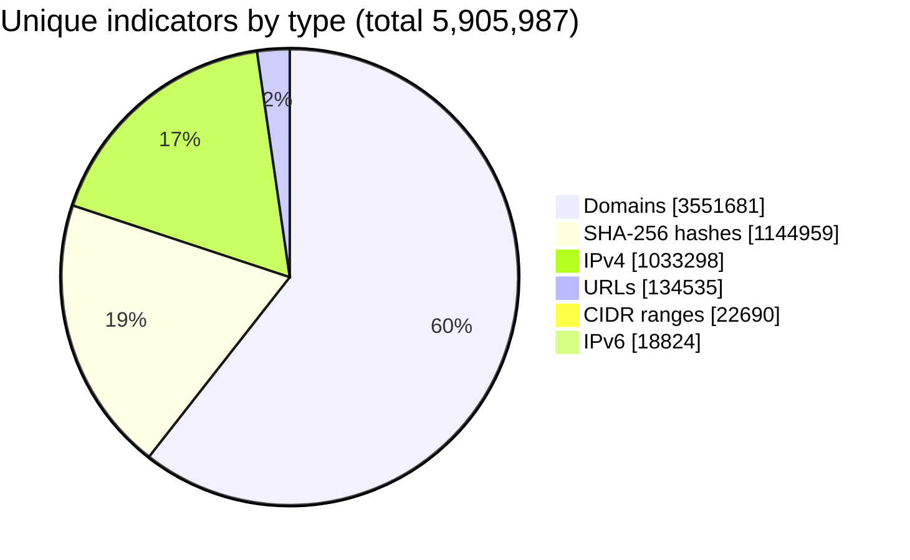
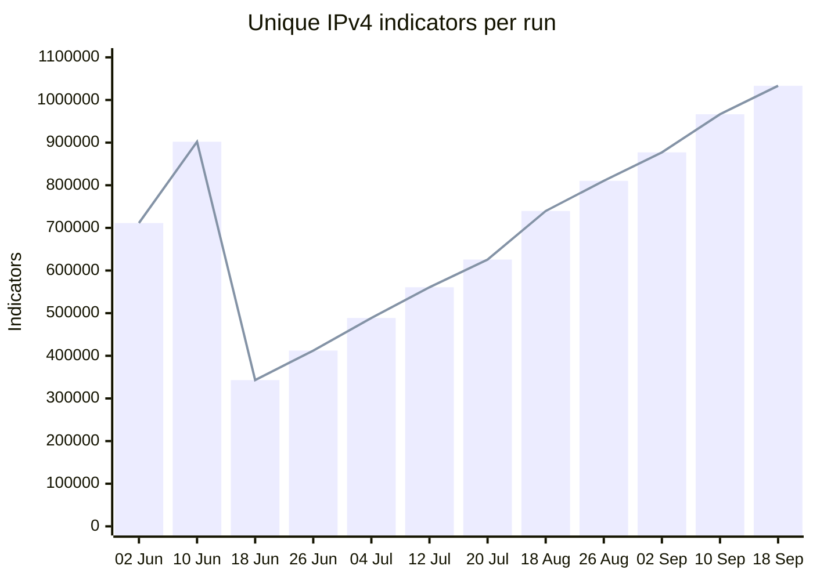
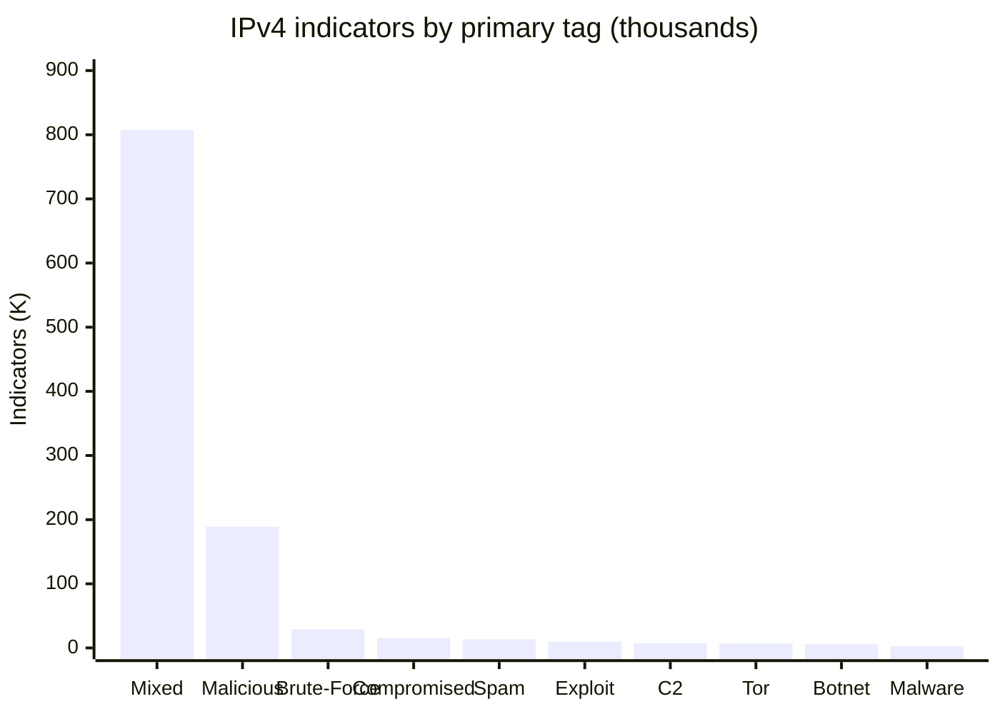
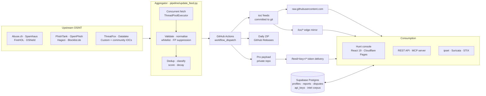
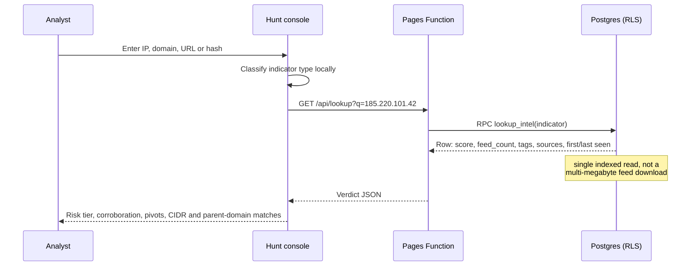
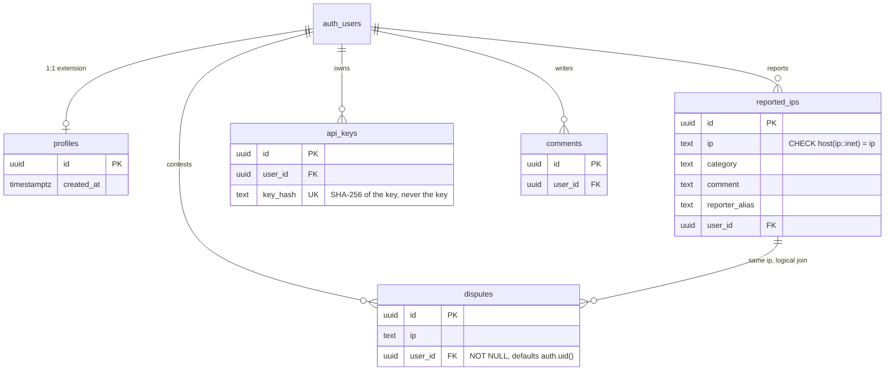

<div align="center">
  <br/>
  

  <h1>Threatbase</h1>

  <p>
    <strong>Enterprise-grade threat intelligence, built entirely on open sources.</strong><br/>
    Aggregated · Deduplicated · Classified · Delivered at zero cost.
  </p>

  <p>
    
    
    
    
    
  </p>

  <p>
    
    
    
    
    
  </p>

  <p>
    <a href="https://threatbase.qzz.io"><b>Hunt an IOC</b></a>
    &nbsp;·&nbsp;
    <a href="https://threatbase.qzz.io/threatfeed"><b>Threat feed</b></a>
    &nbsp;·&nbsp;
    <a href="https://threatbase.qzz.io/api"><b>API docs</b></a>
    &nbsp;·&nbsp;
    <a href="#using-the-feeds"><b>Raw feeds</b></a>
    &nbsp;·&nbsp;
    <a href="#quick-start"><b>Run it locally</b></a>
    &nbsp;·&nbsp;
    <a href="#threatbase-pro"><b>Pro</b></a>
    &nbsp;·&nbsp;
    <a href="https://github.com/kalidada18/threatbase/releases"><b>Archives</b></a>
  </p>

  <br/>

  <em>Threatbase aggregates, deduplicates and distributes open-source threat intelligence at
  scale, so defenders everywhere can block what attackers already know.</em>
</div>

---

**Contents**

| | |
|:--|:--|
| [What is Threatbase?](#what-is-threatbase) | [Threatbase Pro](#threatbase-pro) |
| [Coverage dashboard](#coverage-dashboard) | [Web console](#web-console) |
| [Architecture](#architecture) | [Security posture](#security-posture) |
| [Repository structure](#repository-structure) | [Development](#development) |
| [Data model](#data-model) | [Running the pipeline](#running-the-pipeline) |
| [Using the feeds](#using-the-feeds) | [CI and operations](#ci-and-operations) |
| [API reference](#api-reference) | [Contributing](#contributing) |
| [MCP server](#mcp-server) | [Licence and attribution](#licence-and-attribution) |
| [Deploy-ready formats](#deploy-ready-formats) | |

---

## What is Threatbase?

Threatbase is a **fully automated threat-intelligence pipeline and delivery platform**. It pulls
from dozens of authoritative OSINT feeds, validates and de-duplicates every indicator, classifies
it by threat behaviour, and publishes the result as ready-to-use blocklists, a JSON API, an MCP
server for AI agents, and a browser-based hunt console.

Nothing about the free tier requires an account, a token, or an upstream licence negotiation: the
feeds are plain text on a CDN, the code is MIT, and the whole system runs on infrastructure that
costs nothing to operate.

| | |
|:--|:--|
| **Corpus** | 5,905,987 unique indicators across 6 types, latest run 54 sources |
| **Delivery** | Raw blocklists · edge mirror · REST API · MCP · STIX 2.1 (Pro) · firewall-native shapes (Pro) |
| **Quality** | Per-indicator corroboration count, behaviour tags, first/last-seen, 90-day confidence decay |
| **Console** | IOC hunt, bulk and CSV hunt, RDAP whois, geo, community reports, disputes, leaderboard |
| **Stack** | Python 3.11 · GitHub Actions · React 19 · Cloudflare Pages Functions · Supabase Postgres |

> **Live numbers in this file are a snapshot** of
> [`ioc/data/stats.json`](ioc/data/stats.json) taken on `2026-09-18T10:19Z`.
> Every figure below is reproducible from that file — read it at runtime instead of
> trusting a README.

---

## Coverage dashboard

### Unique indicators by type


```mermaid
pie showData
    title Unique indicators by type (total 5,905,987)
    "Domains" : 3551681
    "SHA-256 hashes" : 1144959
    "IPv4" : 1033298
    "URLs" : 134535
    "CIDR ranges" : 22690
    "IPv6" : 18824
```

### IPv4 corpus, last 90 days

Sampled from the daily series in [`ioc/data/history.json`](ioc/data/history.json)
(89 consecutive runs). Every point is published unedited — including the June step-down.


```mermaid
xychart-beta
    title "Unique IPv4 indicators per run"
    x-axis ["02 Jun", "10 Jun", "18 Jun", "26 Jun", "04 Jul", "12 Jul", "20 Jul", "18 Aug", "26 Aug", "02 Sep", "10 Sep", "18 Sep"]
    y-axis "Indicators" 0 --> 1100000
    bar [711428, 901974, 343023, 412197, 488780, 560653, 625800, 739620, 810353, 877168, 966503, 1033298]
    line [711428, 901974, 343023, 412197, 488780, 560653, 625800, 739620, 810353, 877168, 966503, 1033298]
```

### Classification of the IPv4 feed

Behaviour tags are assigned per indicator, not per upstream feed, so one IP can carry several.
The category totals therefore exceed the IPv4 total.


```mermaid
xychart-beta
    title "IPv4 indicators by primary tag (thousands)"
    x-axis ["Mixed", "Malicious", "Brute-Force", "Compromised", "Spam", "Exploit", "C2", "Tor", "Botnet", "Malware"]
    y-axis "Indicators (K)" 0 --> 900
    bar [807.7, 189.1, 29.4, 15.6, 13.5, 10.0, 7.6, 6.8, 6.4, 2.7]
```

### Indicator types

| Type | Volume | Format | Primary use case |
|:--|--:|:--|:--|
| **IPv4** | 1,033,298 | CSV with score, tags and source trail | Firewall blocklists, SIEM correlation |
| **Domains** | 3,551,681 | One per line, with first-seen | DNS sinkholing, Pi-hole, AdGuard, EDL |
| **SHA-256 hashes** | 1,144,959 | One per line, with first-seen | EDR ingestion, malware triage |
| **URLs** | 134,535 | Full URL per line | Proxy / NGFW blocking |
| **CIDR ranges** | 22,690 | CIDR notation | BGP null-routing, edge filtering |
| **IPv6** | 18,824 | One per line | Next-gen network blocking |

### Freshness and confidence decay

The aggregator does not treat a two-year-old sighting as equivalent to yesterday's.

| Model parameter | Value | Effect |
|:--|:--|:--|
| Half-life | 90 days | Corroboration weight halves every 90 days without a fresh sighting |
| Stale threshold | 365 days | Indicators unseen for a year drop out of the published feed |
| Average freshness | 9.6 days | Mean age of the current corpus |
| Stale indicators published | 0 | The decay filter is applied before write |

Source-level telemetry lives in
[`ioc/data/feed_health.json`](ioc/data/feed_health.json), which records `last_data`,
`last_new_count` and `consecutive_empty` for every upstream. A source that goes quiet is
visible as a number instead of silently shrinking the corpus: in the current snapshot 17 of
the 42 tracked IP sources show `consecutive_empty = 57`, i.e. they have contributed no *new*
indicators in 57 consecutive runs, while `active_feeds = 54` counts sources that returned
usable data in the last run.

---

## Architecture


```mermaid
flowchart LR
    subgraph SRC["Upstream OSINT"]
        A1["Abuse.ch · Spamhaus<br/>FireHOL · DShield"]
        A2["PhishTank · OpenPhish<br/>Hagezi · Blocklist.de"]
        A3["ThreatFox · Datalake<br/>Custom + community IOCs"]
    end

    SRC --> AGG

    subgraph AGG["Aggregator · pipeline/update_feed.py"]
        B1["Concurrent fetch<br/>ThreadPoolExecutor"]
        B2["Validate · normalise<br/>whitelist · FP suppression"]
        B3["Dedup · classify<br/>score · decay"]
        B1 --> B2 --> B3
    end

    AGG --> PUB["GitHub Actions<br/>workflow_dispatch"]

    PUB --> C1["ioc/ feeds<br/>committed to git"]
    PUB --> C2["Daily ZIP<br/>GitHub Releases"]
    PUB --> C3["Pro payload<br/>private repo"]

    C1 --> D1["raw.githubusercontent.com"]
    C1 --> D2["/ioc/* edge mirror"]
    C3 --> D3["/feed/&lt;key&gt;/* token delivery"]

    D1 & D2 --> APP
    D3 --> APP

    subgraph APP["Consumption"]
        E1["Hunt console<br/>React 19 · Cloudflare Pages"]
        E2["REST API · MCP server"]
        E3["ipset · Suricata · STIX"]
    end

    DB[("Supabase Postgres<br/>profiles · reports · disputes<br/>api_keys · intel corpus")] <--> APP
```

| Layer | Stack | Responsibility |
|:--|:--|:--|
| **Intelligence engine** | Python 3.11 · `requests` · `ThreadPoolExecutor` | Concurrent ingestion, validation, de-duplication, classification, scoring |
| **Automation** | GitHub Actions | `update-feed.yml` publishes feeds and archives; `import-ip-intel.yml` loads the bulk corpus. Both are `workflow_dispatch` only — no cron |
| **Web console** | React 19 · Vite · Tailwind · Framer Motion · Cloudflare Pages | IOC hunt, verdict cards, bulk/CSV hunt, RDAP whois, geo, community reports |
| **API & community** | Cloudflare Pages Functions · Supabase · KV rate limiting | Scan and report endpoints, MCP server, Pro feed delivery, Turnstile-gated auth |
| **Delivery** | GitHub Raw · `/ioc/*` edge mirror | Zero-infrastructure blocklist serving; `https://threatbase.qzz.io/ioc/…` mirrors every public file with CDN caching |
| **Archives** | GitHub Releases | Daily ZIP snapshot plus unsplit domain and hash feeds on the rolling `latest` tag |
| **Large-feed mirrors** | Git chunks · release assets | Domain and hash feeds exceed GitHub's file limit, so they ship as ~35–44 MiB sorted chunks under `ioc/domain/` and `ioc/hash/` |

### Anatomy of a verdict lookup


```mermaid
sequenceDiagram
    participant U as Analyst
    participant C as Hunt console
    participant F as Pages Function
    participant P as Postgres (RLS)

    U->>C: Enter IP, domain, URL or hash
    C->>C: Classify indicator type locally
    C->>F: GET /api/lookup?q=185.220.101.42
    F->>P: RPC lookup_intel(indicator)
    P-->>F: Row: score, feed_count, tags, sources, first/last seen
    Note over P: single indexed read, not a<br/>multi-megabyte feed download
    F-->>C: Verdict JSON
    C-->>U: Risk tier, corroboration, pivots, CIDR and parent-domain matches
```

### Repository structure

```text
threatbase/
├── pipeline/           Feed engine (run from repo root)
│   ├── update_feed.py         54 sources, dedup, classify, publish
│   ├── import_ip_intel.py     Bulk-load feeds into the Postgres corpus
│   ├── sync_community_reports.py
│   ├── whitelist.txt          Never-publish ranges (research, RFC-reserved)
│   ├── custom_iocs.txt        Threatbase-owned indicators
│   └── test_*.py              pytest suites for the above
├── ioc/                Generated public feeds, organised by type
│   ├── ip/             IPv4, IPv6, CIDR, categories/, top_ips.json
│   ├── domain/         Domain feed chunks
│   ├── hash/           Hash feed chunks
│   ├── url/            URL feed
│   ├── misp/           MISP free-text exports (IP · domain · URL · hash)
│   └── data/           stats · manifest · history · geo · feed_health · community
├── src/                Web console
│   ├── components/     Pages, blocks/, layout/, ui/, motion/
│   ├── lib/            Validation, verdict logic, rate gates, helpers
│   └── *.ts(x)         App shell, router, auth context, scanner
├── functions/          Cloudflare Pages Functions (the API)
│   ├── api/            lookup · scan · report · rdap · geo · community · MCP admin
│   ├── ioc/            Same-origin edge mirror of every public feed
│   ├── feed/           Token-authenticated Pro delivery
│   └── mcp/            Model Context Protocol server
├── db/                 Supabase SQL: schema, RLS, RPCs (applied by hand, see db/README.md)
├── public/             Static assets, _redirects, _headers, robots, sitemap
├── .github/            ci.yml · update-feed.yml · import-ip-intel.yml · pinned action
└── SECURITY.md         Vulnerability disclosure policy and safe harbour
```

Generated but intentionally **not** committed: `ioc/ip/categories/`, `ioc/firewall/` and
`ioc/stix/`. They are listed in `.gitignore` and pushed by the workflow to a private
repository, because a public copy would make the `/feed/<key>/` paywall unenforceable.

---

## Data model

Postgres on Supabase. Every table below is protected by row-level security; the bulk intel
corpus has RLS enabled with **no policies**, so only the `service_role` key can read it and all
public access goes through the `lookup_intel` RPC.


```mermaid
erDiagram
    auth_users ||--o| profiles : "1:1 extension"
    auth_users ||--o{ reported_ips : "reports"
    auth_users ||--o{ disputes : "contests"
    auth_users ||--o{ api_keys : "owns"
    auth_users ||--o{ comments : "writes"
    reported_ips ||--o{ disputes : "same ip, logical join"

    profiles {
        uuid id PK
        timestamptz created_at
    }
    reported_ips {
        uuid id PK
        text ip "CHECK host(ip::inet) = ip"
        text category
        text comment
        text reporter_alias
        uuid user_id FK
    }
    disputes {
        uuid id PK
        text ip
        uuid user_id FK "NOT NULL, defaults auth.uid()"
    }
    api_keys {
        uuid id PK
        uuid user_id FK
        text key_hash UK "SHA-256 of the key, never the key"
    }
    comments {
        uuid id PK
        uuid user_id FK
    }
```

Notes that matter when you change this schema:

- `api_keys.key_hash` stores a digest only. A leaked table cannot be replayed against the API.
- `disputes.user_id` is `NOT NULL DEFAULT auth.uid()`, so a dispute is bound to an account and
  unique per `(ip, user)` — one vote each.
- `reported_ips.reporter_alias` survives account deletion so the leaderboard and feeds keep
  attributing historical reports.
- Three bulk tables (`ip_intel`, `indicator_intel`, `hash_intel`) hold the normalised corpus and
  power single-row verdict reads; `lookup_intel` is the only read path into them.
- `db/*.sql` files are hand-maintained and idempotent. Apply order and the two files that need
  edits on a fresh database are documented in [`db/README.md`](db/README.md).

---

## Quick Start

### Prerequisites

| Tool | Version | Needed for |
|:--|:--|:--|
| Node.js | 20+ | Console, Functions, build |
| npm | 10+ | Package management |
| Python | 3.11 | Pipeline and its tests |
| Wrangler | installed as a dev dependency | Local Functions runtime and deploys |
| Git | 2+ | Feeds are committed to the repo |

### Console and API

```bash
git clone https://github.com/kalidada18/threatbase.git
cd threatbase
npm install

cp .env.example .env        # Turnstile site key; Supabase falls back to hosted values
npm run dev                 # Vite dev server on http://localhost:5173
```

`npm run dev` serves the console only. Pages Functions (`/api/*`, `/ioc/*`, `/feed/*`, `/mcp`)
require the Wrangler runtime:

```bash
npx login                                                            # one-time
npm run build && npm run preview          # build + wrangler pages dev on http://localhost:8788
```

Local Functions read secrets from `.dev.vars` and bindings from `wrangler.jsonc`
(KV namespace `IOC_CACHE`, `nodejs_compat`). Turnstile's secret half is set as a Pages
secret, never in `.env`:

```bash
npx wrangler pages secret put TURNSTILE_SECRET
```

### Quality gates

```bash
npm run typecheck    # tsc --noEmit
npm run lint         # eslint .
npm test             # vitest run (unit + logic suites in src/ and functions/)
npm run build        # production bundle into dist/
```

### Deploy

```bash
npm run deploy       # vite build && wrangler pages deploy dist --project-name threatbase
```

The site is served from Cloudflare Pages with the SPA rewrite `/* → /index.html 200` and a
locked-down response-header policy defined in [`public/_headers`](public/_headers).

---

## Running the pipeline

The aggregator is a single Python script that reads its feed registry from source and writes the
`ioc/` tree. Run it from the **repository root**, not from `pipeline/`.

```bash
python -m venv .venv && source .venv/bin/activate   # Windows: .venv\Scripts\activate
pip install -r pipeline/requirements.txt

python pipeline/update_feed.py                      # fetch, dedup, classify, publish locally
```

Key inputs and switches:

| Path / variable | Role |
|:--|:--|
| `pipeline/update_feed.py` → `FEEDS`, `DOMAIN_FEEDS`, `HASH_FEEDS`, `URL_FEEDS`, `THREATFOX_FEEDS` | The upstream registry. Add a source here and a matching entry in `FEED_CATEGORIES` |
| `pipeline/whitelist.txt` | Ranges that must never be published (reserved, research, known-good infrastructure) |
| `pipeline/custom_iocs.txt` | Threatbase-owned indicators, injected with the `custom` tag |
| `PRO_ENABLED` | When set, also writes `ioc/ip/categories/`, `ioc/firewall/`, `ioc/stix/` and `manifest-pro.json` |
| `SUPABASE_URL` + `SUPABASE_SERVICE_KEY` | Required by `sync_community_reports.py` and `import_ip_intel.py` only |

Pipeline regression suites:

```bash
pip install pytest
pytest pipeline/test_import_ip_intel.py pipeline/test_dispute_poisoning.py
```

`test_dispute_poisoning.py` is the guard for the community-abuse path: it proves a reported
indicator cannot be suppressed by mass-disputing it from other accounts.

---
