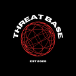

<div align="center">
  <br/>
  

  <h1>⚔️&nbsp; Threatbase</h1>

  <p><strong>Enterprise-grade, open-source threat intelligence.</strong><br/>Automated · Deduplicated · Zero-cost.</p>

  <p>
    <a href="https://github.com/kalidada18/threatbase/actions/workflows/update-feed.yml"></a>
    
    
    
    
    
  </p>

  <p>
    <a href="https://threatbase.qzz.io"><b>🔍 Hunt an IOC</b></a>
    &nbsp;·&nbsp;
    <a href="https://threatbase.qzz.io/threatfeed"><b>📊 Threat Feed</b></a>
    &nbsp;·&nbsp;
    <a href="https://threatbase.qzz.io/api"><b>⚡ API Docs</b></a>
    &nbsp;·&nbsp;
    <a href="#-using-the-feeds"><b>📥 Raw Feeds</b></a>
    &nbsp;·&nbsp;
    <a href="#-threatbase-pro"><b>⭐ Pro</b></a>
    &nbsp;·&nbsp;
    <a href="https://github.com/kalidada18/threatbase/releases"><b>📦 Archives</b></a>
    &nbsp;·&nbsp;
    <a href="https://threatbase.qzz.io/thanks"><b>🙏 Sources</b></a>
  </p>

  <p>
    <a href="https://github.com/kalidada18/threatbase/stargazers"></a>
    <a href="https://github.com/kalidada18/threatbase/network/members"></a>
    
    
    
  </p>

  <br/>

  <em>Built to democratize access to high-quality threat intelligence — one indicator at a time.</em>

</div>

<br/>

---

## 🧩 What is Threatbase?

Threatbase is a **fully-automated threat-intelligence pipeline**. It ingests, validates, and deduplicates malicious indicators from **54 industry OSINT feeds**, then publishes them as ready-to-use blocklists and serves them through a fast IOC-hunting console.

> **Millions** of unique indicators · refreshed continuously · no auth, no rate limits.

```text
  54 OSINT Feeds ──▶ Python Aggregator ──▶ GitHub Actions ─┬─▶ Raw Blocklists
                     (fetch · dedup ·                       ├─▶ Hunt Console
                      validate · classify)                  ├─▶ Daily ZIP Archive
                                                            └─▶ Chunked Git Mirrors
```

### 🏗️ Architecture

| Layer | Stack | Responsibility |
|:--|:--|:--|
| **Intelligence Engine** | Python 3.11 · `ThreadPoolExecutor` | Concurrent ingestion, dedup, validation, classification |
| **Automation** | GitHub Actions | Scheduled & on-demand pipeline runs |
| **Web Console** | React 19 · Tailwind · Framer Motion · Cloudflare Pages | IOC hunt, verdict cards, RDAP whois, community comments |
| **API & Community** | Cloudflare Functions · Supabase · KV rate limiting | Scan/report endpoints, auth-gated reporting, Turnstile |
| **Delivery** | GitHub Raw | Zero-infra, always-on blocklist serving |
| **Archives** | GitHub Releases | Daily ZIP snapshots for retrospective hunting |
| **Large-feed mirrors** | Git chunks + Release assets | Domain/hash feeds ship as ~31 MiB chunks in `ioc/domain/` + `ioc/hash/` and unsplit as release assets |

### 📁 Repository Structure

```
threatbase/
├── pipeline/    Feed engine: update_feed.py, sync_community_reports.py,
│                requirements, whitelist, custom IOCs (run from repo root)
├── ioc/         Generated feeds, organised by type (public):
│   ├── ip/      IPv4/IPv6/CIDR feeds, categories/, top_ips.json
│   ├── domain/  domain feed chunks
│   ├── hash/    hash feed chunks
│   ├── url/     URL feed
│   ├── firewall/ deploy-ready formats (EDL, ipset, Suricata, NDJSON.gz)
│   └── data/    stats, manifest, history, geo, feed_health, community data
├── src/         Web console (Cloudflare Pages)
├── functions/   API endpoints: /api/v1/* scan, report, community (Cloudflare)
├── db/          Supabase SQL: schema, RLS, RPCs (apply manually, see db/README)
├── public/      Static assets, _redirects/_headers, robots, sitemap
└── .github/     update-feed.yml workflow (triggered via workflow_dispatch)
```

---

## 🛡️ IOC Coverage

<div align="center">

| Indicator Type | Primary Use Case |
|:--|:--|
| 🔴 &nbsp;**IPv4** | Firewall blocklists, SIEM correlation |
| 🟠 &nbsp;**IPv6** | Next-gen network blocking |
| 🟡 &nbsp;**CIDR Ranges** | BGP null-routing, edge filtering |
| 🟢 &nbsp;**Domains** | DNS sinkholing, Pi-hole, AdGuard |
| 🔵 &nbsp;**URLs** | Web proxy / NGFW blocking |
| 🟣 &nbsp;**SHA-256 Hashes** | EDR ingestion, malware triage |

<sub>Live indicator metrics are tracked in real-time on the <a href="https://threatbase.qzz.io/threatfeed">threat feed</a>. Indicators are classified into categories such as <code>C2</code>, <code>Botnet</code>, <code>Brute-Force</code>, <code>Exploit</code>, <code>Spam</code>, <code>Tor</code> &amp; more.</sub>

</div>

---

## 📡 Upstream Intelligence Sources

Threatbase curates and deduplicates from authoritative providers, including:

<details open>
<summary><strong>View source highlights</strong></summary>

<br/>

| Provider | Focus Area | IOC Types |
|:--|:--|:--|
| **Abuse.ch** — FeodoTracker, URLhaus, MalwareBazaar | Botnets, C2s, malware delivery | IPs, Domains, URLs, Hashes |
| **Spamhaus** — DROP / EDROP | Spam networks, hijacked ASNs | IPs, CIDRs |
| **FireHOL** | Botnets, cybercrime infrastructure | IPs |
| **DShield** (SANS ISC) | Port scanners, brute-forcers | IPs |
| **PhishTank / OpenPhish** | Phishing campaigns | Domains, URLs |
| **Emerging Threats / CINS Army** | Compromised hosts | IPs |
| **Hagezi** | DNS blocklists (malware & ads) | Domains |
| **Blocklist.de / GreenSnow** | SSH/FTP brute-forcers | IPs |

> Full attribution on the **[Acknowledgements page →](https://threatbase.qzz.io/thanks)**

</details>

---

## 📥 Using the Feeds

Every feed is committed to this repo and served continuously via **GitHub Raw** — drop them straight into your tooling. No auth. No rate limits.

> Feeds now live in type folders — `ioc/ip/`, `ioc/domain/`, `ioc/hash/`,
> `ioc/url/`, `ioc/data/`. The old flat `ioc/<file>` raw URLs are retired; update
> your hotlinks. Release asset download URLs are unchanged.
>
> The per-category and firewall-format feeds moved to [Threatbase
> Pro](#-threatbase-pro) (*launching soon*) and are no longer in this repo. Everything
> above stays free and MIT — see the notes under each section for the equivalent
> one-liner off the full feed.

### 🌐 Network Blocklists

```text
https://raw.githubusercontent.com/kalidada18/threatbase/main/ioc/ip/threatbase-ip.txt
https://raw.githubusercontent.com/kalidada18/threatbase/main/ioc/ip/threatbase-ipv6.txt
https://raw.githubusercontent.com/kalidada18/threatbase/main/ioc/ip/threatbase-cidr.txt
```

| Feed | File | Format |
|:--|:--|:--|
| IPv4 Blocklist | `threatbase-ip.txt` | `IP,FeedCount,RiskScore,Tags` |
| IPv6 Blocklist | `threatbase-ipv6.txt` | One IP per line |
| CIDR Blocklist | `threatbase-cidr.txt` | CIDR notation |

#### 🎯 Category-Split IP Feeds &nbsp;·&nbsp; ⭐ Pro

> Apply different policies per threat type — hard-block C2, just alert on Tor.

Per-category IPv4 blocklists (same `IP,FeedCount,RiskScore,Tags` format) are a
[**Threatbase Pro**](https://threatbase.qzz.io/pricing) feed. Generate an API key on your
[Profile](https://threatbase.qzz.io/profile) page and fetch them under your own token:

```text
https://threatbase.qzz.io/feed/<your-key>/ip/categories/threatbase-ip-c2.txt
https://threatbase.qzz.io/feed/<your-key>/ip/categories/threatbase-ip-botnet.txt
https://threatbase.qzz.io/feed/<your-key>/ip/categories/threatbase-ip-bruteforce.txt
```

One stable URL your firewall can poll unattended, refreshed every 15 minutes.

| Category | File | Use Case |
|:--|:--|:--|
| C2 | `threatbase-ip-c2.txt` | Command-and-control — block aggressively |
| Botnet | `threatbase-ip-botnet.txt` | Known botnet members |
| Brute-Force | `threatbase-ip-bruteforce.txt` | SSH/FTP/RDP brute-forcers |
| Tor | `threatbase-ip-tor.txt` | Tor exit nodes — often alert-only |
| Spam | `threatbase-ip-spam.txt` | Spam-source networks |
| Exploit | `threatbase-ip-exploit.txt` | Active exploitation attempts |
| Malware | `threatbase-ip-malware.txt` | Malware-hosting / delivery |

<sub>Per-file counts are published in <a href="ioc/data/stats.json"><code>stats.json</code></a> under <code>ip_category_files</code> — free to inspect, even though the files themselves are Pro. The full IPv4 feed above carries the same <code>Tags</code> column, so you can split it yourself.</sub>

<sub>Prefer not to parse CSV? Every category also ships pre-shaped as ipset / Suricata / NDJSON — see <a href="#-deploy-ready-formats--nbspnbsp-pro">Deploy-Ready Formats</a>.</sub>

### 🕸️ DNS & Web Blocklists

> Compatible with Pi-hole, AdGuard Home, Squid, and Palo Alto EDL.

```text
https://github.com/kalidada18/threatbase/releases/download/latest/threatbase-domain.txt
https://raw.githubusercontent.com/kalidada18/threatbase/main/ioc/url/threatbase-url.txt
```

| Feed | File | Format |
|:--|:--|:--|
| Domain Blocklist | `threatbase-domain.txt` | One domain per line |
| URL Blocklist | `threatbase-url.txt` | Full URL per line |

### 💀 Malware File Hashes

> A vast, continuously updated repository of SHA-256 hashes for EDR ingestion and malware-triage pipelines.

```text
https://github.com/kalidada18/threatbase/releases/download/latest/threatbase-hash.txt
```

| Feed | File | Format |
|:--|:--|:--|
| Malware Hash DB | `threatbase-hash.txt` | SHA-256, one per line |

### 🧩 Chunked Mirrors of the Large Feeds

> The domain and hash feeds exceed GitHub's 100 MiB single-file limit, so this
> repo **also** carries them split into git-committed chunks under
> [`ioc/domain/`](ioc/domain/) and [`ioc/hash/`](ioc/hash/).
> Release assets (above) stay the recommended download for humans; the chunks are
> for tooling that prefers plain raw.githubusercontent.com pulls.

```text
https://raw.githubusercontent.com/kalidada18/threatbase/main/ioc/domain/threatbase-domain-01.txt
https://raw.githubusercontent.com/kalidada18/threatbase/main/ioc/domain/threatbase-domain-02.txt
https://raw.githubusercontent.com/kalidada18/threatbase/main/ioc/hash/threatbase-hash-01.txt
https://raw.githubusercontent.com/kalidada18/threatbase/main/ioc/hash/threatbase-hash-02.txt
```

<details>
<summary><strong>Chunk rules</strong></summary>

<br/>

- Chunks **partition the sorted feed**: each covers a contiguous key range, is
  individually sorted, and concatenating them in numeric order reproduces the
  unsplit file byte-for-byte.
- The chunk **count is never fixed** — it grows as the feed grows. Read the
  authoritative layout from [`ioc/data/manifest.json`](ioc/data/manifest.json) or the
  `chunks` / `chunk_files` keys of [`ioc/data/stats.json`](ioc/data/stats.json) instead of
  hardcoding `2`.
- Because ranges are contiguous, a lookup tool can binary-search a chunk
  directly, or skip all downloads when a query falls between two chunks' ranges.
  This is exactly how the [dashboard search](https://threatbase.qzz.io) works —
  it fetches only the one chunk that can contain the query.

</details>

---

## 🔥 Deploy-Ready Formats &nbsp;·&nbsp; ⭐ Pro

> The pipeline publishes the IPv4 feed pre-shaped for firewalls, IPS and SIEMs —
> no CSV parsing on your side. These are a
> [**Threatbase Pro**](https://threatbase.qzz.io/pricing) feed, served under your own
> token at `https://threatbase.qzz.io/feed/<your-key>/firewall/<file>`.

| File | Shape | For | ~Size |
|:--|:--|:--|:--|
| `ip-plain.txt` | one bare IP per line, all 912k | pf, OPNsense, UFW, nftables — anything without an entry cap | 12 MB |
| `ip-multisource.txt` | bare IPs with **2+ independent sources** (305k) | conservative hard-block policies | 5 MB |
| `ip-top50k.txt` | the **50,000 best-corroborated** IPs, bare | PAN-OS EDL, FortiGate threat feed | 700 KB |
| `ip.ipset` | `ipset -exist restore` file, atomic swap reload (set: `threatbase`) | Linux netfilter | 29 MB |
| `ip-suricata.rules` | `drop` rules, IPs with **3+ sources** (106k, sids 50000000+) | Suricata / Snort IPS | 12 MB |
| `ip.jsonl.gz` | NDJSON: `{ip, feeds, score, tags[], sources[], first_seen, last_seen}` | Splunk HEC, Elastic `_bulk`, Wazuh | 5 MB |
| `manifest-pro.json` | SHA-256 of every Pro file | verifying a feed survived transit | 4 KB |

> **Use `ip-top50k.txt` on appliances.** PAN-OS caps external dynamic lists at
> **50,000 IP entries across all EDLs** (150,000 only on the PA-5000/PA-7000 series),
> and FortiGate's threat-feed limit is per model (300,000 on a 6K, lower below it).
> Neither tells you it dropped the overflow — feed a 912k list to a standard PA and it
> silently enforces ~5% of it. `ip-top50k.txt` is that list ranked by how many
> independent feeds saw each IP, truncated to fit, so the entries you keep are the ones
> worth keeping. Same file exists per category.

### Per-category, same six shapes

The [category split](#-category-split-ip-feeds--nbspnbsp-pro) is also published pre-shaped, so
"hard-block C2, alert-only on Tor" is two files rather than a CSV filter you maintain:

```text
https://threatbase.qzz.io/feed/<your-key>/firewall/categories/c2/ip.ipset
https://threatbase.qzz.io/feed/<your-key>/firewall/categories/tor/ip-suricata.rules
https://threatbase.qzz.io/feed/<your-key>/firewall/categories/bruteforce/ip.jsonl.gz
```

`<slug>` is any of `c2`, `botnet`, `bruteforce`, `tor`, `spam`, `exploit`, `malware`,
`malicious`, `compromised`, `scanner`, `mixed`. Two guarantees that let you load several
side by side:

- **ipset name is `threatbase-<slug>`**, so sets never collide on restore and each gets
  its own `--match-set` rule.
- **sids are blocked per category** (`c2` 51000000+, `botnet` 52000000+, then 1M per
  category in the order listed above; the full feed owns 50000000+). Suricata silently
  keeps only the last rule for a duplicate sid, so shared ranges would cost you coverage
  — these are stable, and safe to write `suppress`/`threshold` rules against.
  Threatbase claims **50000000–77999999** in the self-organised registry at
  [sidallocation.org](https://sidallocation.org/), so nothing here collides with ET Open,
  ExtraHop, Positive Technologies, IPFire or abuse.ch rules loaded alongside it.

```bash
# Linux firewall — one match rule instead of 900k. The `-exist` flag is required:
# the file loads into a staging set and swaps atomically, so re-running this keeps
# the iptables rule working and never matches traffic against a half-loaded set.
curl -sO https://threatbase.qzz.io/feed/$KEY/firewall/ip.ipset
sudo ipset -exist restore < ip.ipset
sudo iptables -I INPUT -m set --match-set threatbase src -j DROP

# Per-category policy: drop C2 outright, only log Tor.
curl -s https://threatbase.qzz.io/feed/$KEY/firewall/categories/c2/ip.ipset  | sudo ipset -exist restore
curl -s https://threatbase.qzz.io/feed/$KEY/firewall/categories/tor/ip.ipset | sudo ipset -exist restore
sudo iptables -I INPUT -m set --match-set threatbase-c2  src -j DROP
sudo iptables -I INPUT -m set --match-set threatbase-tor src -j LOG --log-prefix 'TOR '

# Suricata IPS — add to suricata.yaml:
#   default-rule-path: /etc/suricata/rules
#   rule-files: [threatbase-ip.rules]
# Want alerts instead of drops for a category? sed 's/^drop /alert /' on the file.

# SIEM bulk ingest (both Splunk HEC and Elastic _bulk accept gz):
curl -s https://threatbase.qzz.io/feed/$KEY/firewall/ip.jsonl.gz | gunzip
```

> Why gate on source count and not risk score? ~99% of the feed is tier HIGH —
> tier doesn't discriminate. Independent corroboration does.

---

## ⭐ Threatbase Pro


Everything above stays **free and MIT, permanently**. Pro covers the parts that only
start to matter once a feed is wired into production kit: freshness, per-category
policy, and data accurate enough to hard-block on without hand-checking it first.

| | Free | Pro |
|:--|:--:|:--:|
| Daily blocklists, all IOC types (IP · IPv6 · CIDR · domain · URL · hash) | ✅ | ✅ |
| Hunt console, verdict cards, community reports | ✅ | ✅ |
| MIT-licensed · no auth · no rate limits | ✅ | ✅ |
| **15-minute** refresh | — | ✅ |
| Per-category IP lists (C2 · botnet · brute-force · spam · Tor · …) | — | ✅ |
| [Deploy-ready formats](#-deploy-ready-formats--nbspnbsp-pro), per category (ipset · Suricata · NDJSON · EDL) | — | ✅ |
| Stable token URL your firewall polls unattended | — | ✅ |
| False-positive suppression guarantee | — | ✅ |
| Email support | — | ✅ |

<div align="center"><strong>$25 / month</strong> &nbsp;·&nbsp; <a href="https://threatbase.qzz.io/pricing">Pricing &amp; sign-up →</a></div>

### More accurate data — concretely

Accuracy claims are cheap, so here is the actual mechanism behind each one:

- **Corroboration is exposed, not averaged away.** Every IP carries `FeedCount` — how
  many *independent* upstreams saw it. `ip-multisource.txt` (2+ sources),
  `ip-suricata.rules` (3+) and `ip-top50k.txt` (ranked, then cut to the appliance limit)
  are pre-filtered on it, so you tune aggression by evidence instead of by a risk tier
  that reads HIGH for ~99% of the feed.
- **Classification per indicator, not per feed.** Tags travel with the IP and drive the
  category split, so "hard-block C2, alert-only on Tor" is two files instead of a CSV
  filter you maintain yourself.
- **15-minute refresh.** Scanner and brute-force infrastructure rotates within hours;
  a once-daily list is stale for exactly the categories that move fastest.
- **False-positive suppression.** Whitelist and community-reported FPs are applied
  before publish, and a bad indicator you report gets removed from the next run.
- **Integrity you can verify.** `manifest-pro.json` carries a SHA-256 for every Pro
  file, so a feed truncated in transit fails loudly instead of quietly shrinking
  your blocklist.

> **Launching soon.** Billing is handled manually for now — Stripe doesn't operate in
> Nepal. Email **threatbasepro@gmail.com** to get on the list; keys are issued from your
> [Profile](https://threatbase.qzz.io/profile) page once your account is flagged Pro.

---

## ⚡ Quick Integration

<details>
<summary><strong>iptables — Linux firewall</strong></summary>

<br/>

```bash
# Free feed — cut(1) drops the score columns, giving the same bare-IP list
# the Pro firewall/ip-plain.txt ships pre-shaped.
curl -s https://raw.githubusercontent.com/kalidada18/threatbase/main/ioc/ip/threatbase-ip.txt \
  | grep -v '^#' | cut -d, -f1 \
  | xargs -I{} sudo iptables -A INPUT -s {} -j DROP
```
</details>

<details>
<summary><strong>Pi-hole / AdGuard — DNS blocklist</strong></summary>

<br/>

Add this URL as a blocklist source:

```text
https://github.com/kalidada18/threatbase/releases/download/latest/threatbase-domain.txt
```
</details>

<details>
<summary><strong>Splunk / SIEM — batch ingestion</strong></summary>

<br/>

```bash
# Pull the latest daily archive for bulk lookup ingestion
wget https://github.com/kalidada18/threatbase/releases/latest/download/threatbase-archive-2026.08.29.zip
unzip threatbase-archive-*.zip -d ./ioc-feeds/
```
</details>

---

## 🗄️ Historical Archives

A full ZIP of the complete feed is published daily to the **[Releases](https://github.com/kalidada18/threatbase/releases)** page, alongside the unsplit `threatbase-domain.txt` / `threatbase-hash.txt` on the rolling [`latest`](https://github.com/kalidada18/threatbase/releases/tag/latest) tag.

```text
threatbase-archive-YYYY.MM.DD.zip
├── threatbase-ip.txt
├── threatbase-ipv6.txt
├── threatbase-cidr.txt
├── threatbase-domain.txt
├── threatbase-url.txt
└── threatbase-hash.txt
```

Ideal for **retrospective SIEM hunting**, academic research, and historical IOC enrichment.

---

## 🤝 Contributing

Threatbase is community-powered. Contributions are welcome:

- 📥 **New feed sources** — open an issue with the feed URL + license
- 🐛 **Bug reports** — label as `bug`
- 💡 **Feature requests** — label as `enhancement`

---

<div align="center">
  <br/>
  <sub>
    ⚖️ <a href="LICENSE">MIT License</a> &nbsp;·&nbsp;
    Upstream feed data remains subject to each provider's Terms of Service &nbsp;·&nbsp;
    Made in 🇳🇵
  </sub>
  <br/><br/>
  <sub><em>If Threatbase helps your security ops, consider starring ⭐ the repo.</em></sub>
  <br/><br/>
</div>
